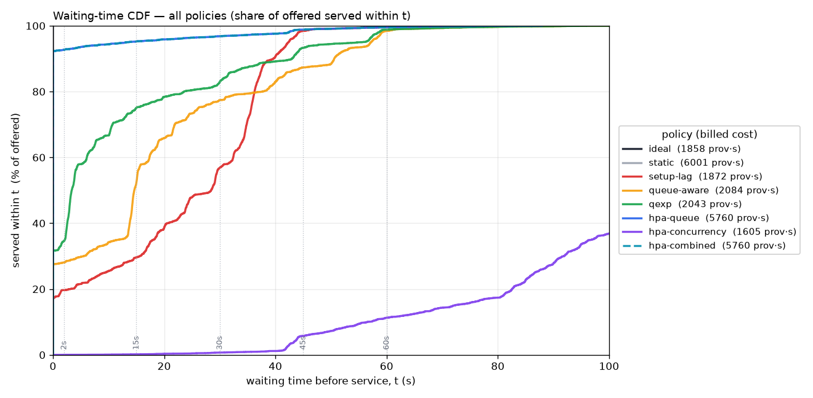
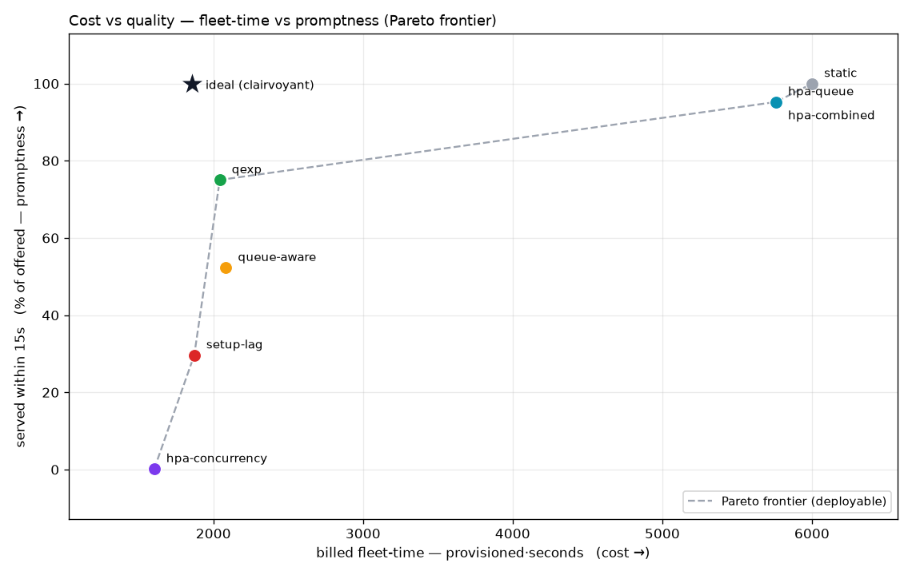
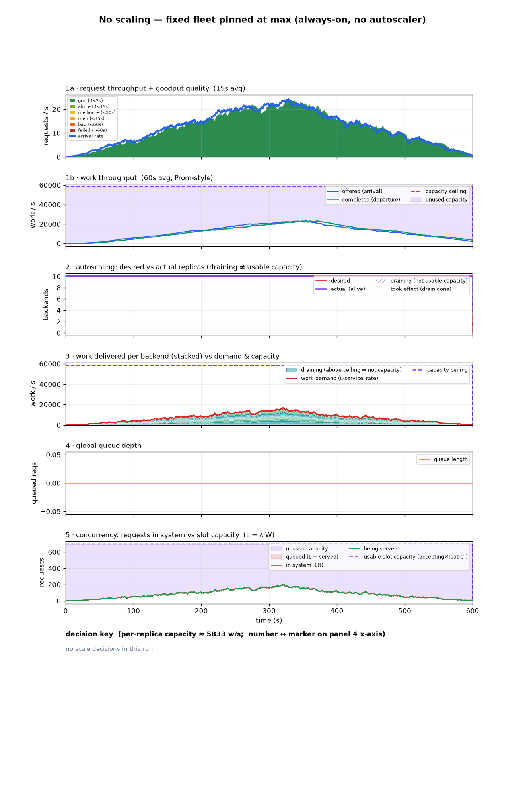
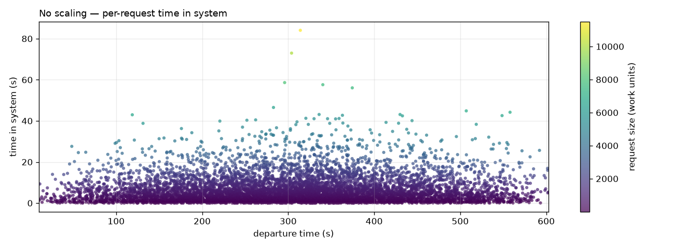
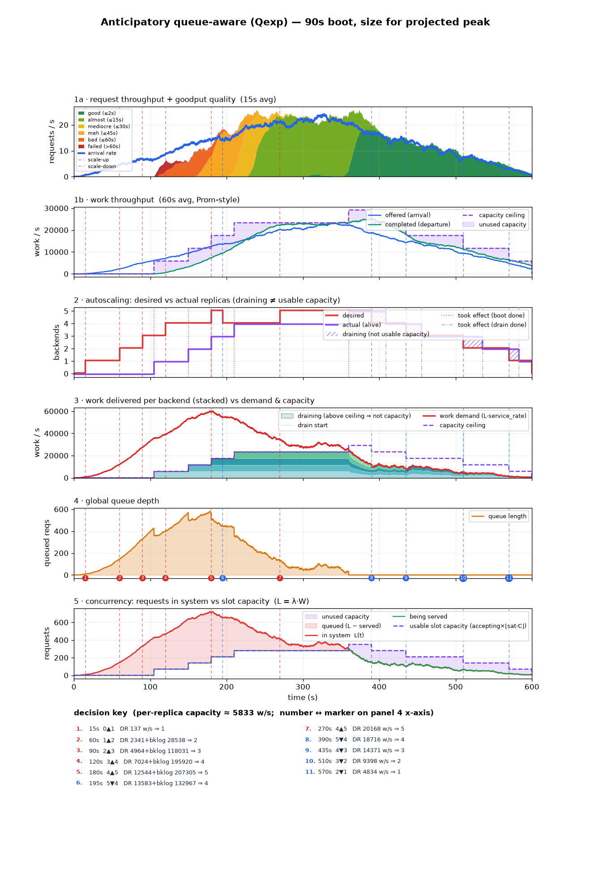
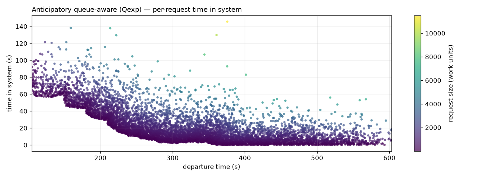
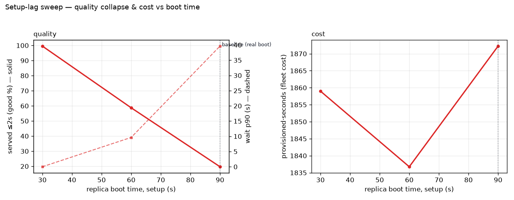
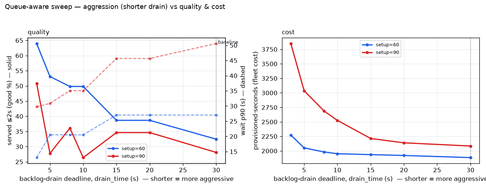
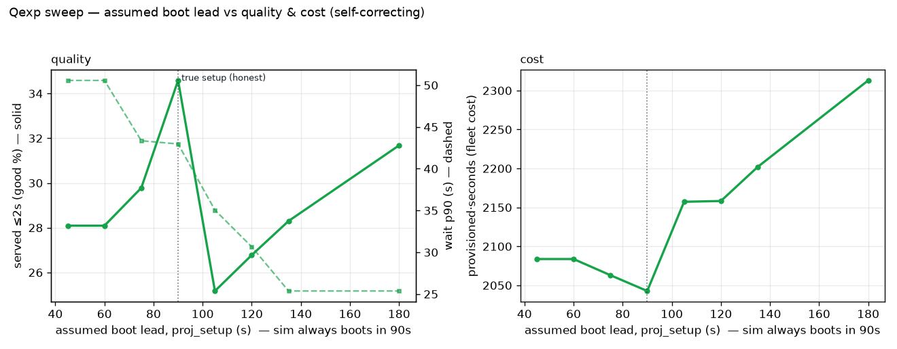

# Autoscaling Behavioral Demo — comparison report

One request trace, several sizing approaches. **Every figure is the actual simulated execution** — a scaling *policy* only changes the supply trace; the graphs always reflect what really happened. Calibration is anchored to a real WVA decode-heavy benchmark: peak ~24 req/s, ~1000-token mean work, per-backend concurrency `C=100`, `service_rate ≈ 83` tokens/s (one backend clears ~8.3 req/s), usable ceiling `⌊0.7·C⌋ = 70` concurrent, and a **90 s replica boot** for the lagged scenarios.

> This is the static, GitHub-renderable view. The interactive version
> (tabbed compare / browse / table / glossary, with a zoom slider) lives at
> [`out/index.html`](out/index.html) — open it locally; GitHub strips its JS/CSS.
> Rebuild everything with `python run.py && python report.py`.

**Every scenario completes 100% of requests.** The story is *not* completion — it is the **waiting-time quality mix** (how prompt service was) and the **cost** (`replica·seconds` of fleet-time). A policy can "finish everything" and still be terrible, or be perfectly prompt and burn 3× the fleet.

---

## The story in one table

Quality rows are the **cumulative** share of offered requests served *within* each wait bound (the wait CDF sampled at 2 / 15 / 45 / 60 s); cost is fleet-time.

| metric | ideal | static | setup-lag | queue-aware | qexp | hpa-queue | hpa-concurrency | hpa-combined |
|---|---|---|---|---|---|---|---|---|
| ≤2s % | 100.0 | 100.0 | 19.7 | 28.1 | 34.6 | 92.7 | 0.0 | 92.7 |
| ≤15s % | 100.0 | 100.0 | 29.7 | 52.3 | 75.0 | 95.2 | 0.3 | 95.2 |
| ≤45s % | 100.0 | 100.0 | 98.4 | 87.3 | 93.3 | 98.8 | 6.1 | 98.8 |
| ≤60s % | 100.0 | 100.0 | 99.6 | 98.4 | 98.8 | 99.6 | 11.6 | 99.6 |
| unfinished | 0 | 0 | 0 | 0 | 0 | 0 | 0 | 0 |
| wait avg (s) | 0.0 | 0.0 | 23.3 | 18.9 | 11.9 | 2.0 | 105.6 | 2.0 |
| wait p95 (s) | 0.0 | 0.0 | 42.4 | 57.2 | 55.4 | 13.2 | 141.1 | 13.2 |
| replicas max | 5 | 10 | 5 | 5 | 5 | 10 | 4 | 10 |
| replica·seconds | 1980 | 6002 | 1536 | 1629 | 1665 | 4860 | 1200 | 4860 |
| provisioned·seconds | 1980 | 6002 | 1986 | 2169 | 2130 | 5760 | 1635 | 5760 |
| utilization | 0.62 | 0.20 | 0.80 | 0.75 | 0.74 | 0.25 | 1.02 | 0.25 |

Readings: the **ideal** clairvoyant sizer is the only one that sees future arrivals — 100% prompt at the lowest real cost, the reference everything else is measured against. **No scaling** is also 100% prompt but pins at the max and burns ~3× the ideal fleet at the lowest utilisation — promptness bought by paying for peak through every valley. **Setup-lag → queue-aware → Qexp** is the deployable-sizer progression under 90s boot: a correct policy landing 90s late is only ~20% prompt; a reactive backlog term lifts that to ~28% but worsens the tail (it chases the queue after the pile-up); **Qexp** — the anticipatory periodic loop that sizes to the projected backlog peak — reaches ~35% prompt with a shorter tail (p90 43s vs 51s) and a lower queue peak, at the SAME fleet cost. **hpa-queue** and **hpa-combined** are prompt (~93% good) at ~2.5× the ideal fleet. **hpa-concurrency** is catastrophic — 88% wait over a minute — because its signal is capacity-capped and blind to the queue. **hpa-combined = hpa-queue**: the queue trigger dominates the KEDA `max`, rescuing concurrency's blind spot.

Full metrics table (all rows)

| metric | ideal | static | setup-lag | queue-aware | qexp | hpa-queue | hpa-concurrency | hpa-combined |
|---|---|---|---|---|---|---|---|---|
| offered | 7159 | 7159 | 7159 | 7159 | 7159 | 7159 | 7159 | 7159 |
| completed | 7159 | 7159 | 7159 | 7159 | 7159 | 7159 | 7159 | 7159 |
| completed % | 100.0 | 100.0 | 100.0 | 100.0 | 100.0 | 100.0 | 100.0 | 100.0 |
| unfinished | 0 | 0 | 0 | 0 | 0 | 0 | 0 | 0 |
| ≤2s % | 100.0 | 100.0 | 19.7 | 28.1 | 34.6 | 92.7 | 0.0 | 92.7 |
| ≤15s % | 100.0 | 100.0 | 29.7 | 52.3 | 75.0 | 95.2 | 0.3 | 95.2 |
| ≤30s % | 100.0 | 100.0 | 56.8 | 77.4 | 82.9 | 96.8 | 0.9 | 96.8 |
| ≤45s % | 100.0 | 100.0 | 98.4 | 87.3 | 93.3 | 98.8 | 6.1 | 98.8 |
| ≤60s % | 100.0 | 100.0 | 99.6 | 98.4 | 98.8 | 99.6 | 11.6 | 99.6 |
| failed (>60s) % | 0.0 | 0.0 | 0.4 | 1.6 | 1.2 | 0.4 | 88.4 | 0.4 |
| wait avg (s) | 0.0 | 0.0 | 23.3 | 18.9 | 11.9 | 2.0 | 105.6 | 2.0 |
| wait p50 (s) | 0.0 | 0.0 | 28.5 | 14.6 | 3.4 | 0.0 | 115.3 | 0.0 |
| wait p75 (s) | 0.0 | 0.0 | 35.7 | 26.1 | 15.0 | 0.0 | 129.8 | 0.0 |
| wait p90 (s) | 0.0 | 0.0 | 39.6 | 50.6 | 43.0 | 0.0 | 138.8 | 0.0 |
| wait p95 (s) | 0.0 | 0.0 | 42.4 | 57.2 | 55.4 | 13.2 | 141.1 | 13.2 |
| wait p99 (s) | 0.0 | 0.0 | 47.4 | 62.4 | 62.4 | 47.4 | 143.1 | 47.4 |
| time/work avg (s/u) | 0.01 | 0.01 | 0.27 | 0.23 | 0.14 | 0.03 | 1.17 | 0.03 |
| time/work p50 (s/u) | 0.01 | 0.01 | 0.04 | 0.03 | 0.02 | 0.01 | 0.16 | 0.01 |
| time/work p90 (s/u) | 0.01 | 0.01 | 0.24 | 0.19 | 0.11 | 0.01 | 1.04 | 0.01 |
| time/work p95 (s/u) | 0.01 | 0.01 | 0.49 | 0.39 | 0.26 | 0.03 | 2.15 | 0.03 |
| time/work p99 (s/u) | 0.01 | 0.01 | 2.80 | 2.48 | 1.49 | 0.23 | 13.04 | 0.23 |
| replicas avg | 3.30 | 10.00 | 2.56 | 2.71 | 2.77 | 8.10 | 2.00 | 8.10 |
| replicas std | 1.37 | 0.02 | 1.57 | 1.69 | 1.67 | 3.83 | 1.32 | 3.83 |
| replicas max | 5 | 10 | 5 | 5 | 5 | 10 | 4 | 10 |
| replica·seconds | 1980 | 6002 | 1536 | 1629 | 1665 | 4860 | 1200 | 4860 |
| provisioned·seconds | 1980 | 6002 | 1986 | 2169 | 2130 | 5760 | 1635 | 5760 |
| boot-lag waste·s | 0 | 0 | 450 | 540 | 465 | 900 | 435 | 900 |
| utilization | 0.62 | 0.20 | 0.80 | 0.75 | 0.74 | 0.25 | 1.02 | 0.25 |

---

## Cost & waiting-time tradeoffs

Two cross-policy views on one axis — the full waiting-time CDF and the cost-vs-quality frontier.

**Waiting-time CDF — all policies on one axis.** Each curve is a policy's **wait CDF over the OFFERED denominator**: height at time *t* = share of all arrivals served within *t* s. Curves that asymptote **below 100%** stranded work (unfinished). Read left-to-right: the further up-and-left, the prompter. Legend carries each policy's billed fleet-cost, so promptness and cost read together. This is the same data as the Table's “≤Ns %” rows, shown continuously.

**Cost vs quality — the Pareto frontier.** x = billed fleet-time (provisioned·seconds, the cost); y = promptness (% of offered served within 15s). The dashed line is the frontier over the **deployable** policies — anything below-and-right of it is dominated (something is both cheaper AND prompter). **ideal** is drawn apart as the clairvoyant reference (not deployable). This is where “same cost, better quality” becomes literal: Qexp sits on the frontier, queue-aware just inside it at ~the same cost.

---

## Scenarios

### 1 · Ideal

*setup=0 · size to CENTERED demand rate (DR) × headroom (clairvoyant)*

what does good look like? → 100% served ≤2s; never queues on a smooth bump

latency

### 2 · No scaling

*fixed fleet pinned at maxReplicaCount=10 for the whole run · no autoscaler, pre-warmed (setup=0)*

what if you just provision for max and never scale? → 100% prompt (never queues on this bump), but the most expensive fleet (6000 rep·s ≈ 3× ideal) at the lowest utilisation — promptness bought by paying for peak capacity through every valley

latency

### 3 · Setup lag

*setup=90 · the SAME demand-tracking commands as ideal, landing 90s late*

does a correct policy survive 90s boot lag? → still completes 100%, but only ~20% served promptly. ⚠ confound: setup-lag→queue-aware changes TWO things at once (foresight lost, centered→trailing window, AND a backlog-drain term added) — not a clean A/B on the backlog term alone

latency

### 4 · Queue-aware

*setup=90, drain_time=30 · demand-tracking + backlog-drain (reactive, TRAILING)*

can a reactive backlog term rescue quality? → only modestly (~28% prompt), and it worsens the tail (chases the backlog after it has already piled up during the boot) — motivates anticipation, see Qexp

latency

### 5 · Qexp (anticipatory)

*setup=90, drain_time=30 · anticipatory: a PERIODIC control loop that sizes to the backlog PEAK projected over the committed boot schedule (up now + pending at their estimated land-times). Reads only the observable queue LEVEL — no foresight of arrivals*

does anticipating the boot-window pile-up help? → yes: ~35% prompt vs reactive's ~28%, tail p90 43s vs 51s, and a lower queue peak (583 vs 704) — at the SAME fleet cost (2130 vs 2169 prov·s). It orders sooner and HOLDS through the boot instead of chasing the queue after the fact. Still no foresight — it only projects the CURRENT queue forward (axis-2 dead-time compensation, not axis-1)

latency

### 6 · HPA queue

*KEDA queue-depth · AverageValue target=1/replica → desired=ceil(Q) · setup=90, cap 10*

naive queue-depth scaling (target 1)? → 92.7% prompt, but pins at the maxReplicaCount=10 cap and burns ~2.5× the fleet (4860 vs ideal 1980 rep·s); the cold-start backlog is the only tail

latency

### 7 · HPA concurrency

*KEDA running-count · AverageValue target c≈58/replica → desired=ceil(R/c) · setup=90, cap 10*

concurrency-only scaling? → catastrophic: the running-count signal is capacity-capped (R ≤ n·usable_C), so it is BLIND to the 2569-deep queue behind it, stalls at 4 replicas, 88% wait >60s. Concurrency alone cannot outrun boot lag

latency

### 8 · HPA combined

*KEDA both triggers · desired=max(queue, concurrency) · up on either, down on both · setup=90, cap 10*

combining the two triggers (native KEDA max)? → the queue trigger rescues the concurrency blind spot; matches queue-depth (92.7% prompt, 4860 rep·s) — this is the well-lit path's saturation+running pairing

latency

---

## Parameter sweeps

Trend + calibration line-plots (full numeric tables in [`out/sweep.md`](out/sweep.md)). Solid = good %, dashed = wait p90, dotted vertical = baseline.

---

## Glossary

**range vs interval.** A **range** is a lookback span (how far back a windowed average reaches, PromQL `metric[5m]`); an **interval** is a cadence (how often something recomputes/samples). Independent: average over 60s, decide every 15s.

**the three meanings of “rate”.** **service_rate** = tokens/s one in-service request advances at (a backend property, fixed). **DR** (demand rate) = arrival_rate × E[size], tokens/s — a demand ESTIMATE, not a measurement. **measured throughput** = observed arrival/departure counts per second. Three different quantities the word “rate” gets loosely attached to; only measured throughput is one you actually observe directly.

**DR — demand rate (was OWR).** DR(t) = arrival_rate(t) × E[size], in **tokens/s** — the offered *work* rate, not requests/s (each request's work/size varies, so demand is measured in tokens). An **estimate**, not a measurement: arrival count is observable but a request's work (size) is not known at arrival. Valid as a proxy only under the **stationary-shape assumption** — arrival rate varies over time, the size distribution does not. (Named `owr` in the code / trace files.)

**C / sat_frac / usable ceiling.** **C** = raw per-backend concurrency limit (100 here). **sat_frac** = usable fraction (0.7); a backend saturates at the **usable ceiling** ⌊sat_frac·C⌋ = 70 concurrent, a flat stand-in for the way real serving (vLLM) stops gaining goodput as concurrency climbs. Usable per-backend throughput = ⌊sat_frac·C⌋ × service_rate.

**headroom.** Scale-up utilization target. headroom=1.2 sizes for ~1/1.2 ≈ 83% utilization, leaving slack for noise.

**sizing_range / decision_interval / drain_time.** **sizing_range** (60s) = the lookback the sizer averages DR over. **decision_interval** (15s) = how often it recomputes the desired count. **drain_time** (30s, queue-aware only) = the deadline over which the backlog term aims to clear the current queue.

**setup / drain.** **setup** = boot lag, start→up (dead time; 90s for the lagged scenarios). **drain** = drain time, stop→down.

**foresight — seeing future arrivals (axis 1).** Whether a sizer can see arrivals that haven't happened yet. A **centered** window [t−r/2, t+r/2] averages future arrivals into the estimate; a **trailing** window [t−r, t] sees only the past. This is real foresight, and **only the clairvoyant ideal sizer has it** — no deployable controller can see the future. This is the one axis that separates the ideal from every real strategy.

**setup / dead-time compensation (axis 2 — NOT foresight).** Whether a sizer acts early enough to cover boot lag: it must aim at the demand it will face at t+setup and credit the replicas already booting, so it doesn't re-order the same backlog every interval (integral windup). A **real** controller does this WITHOUT foresight — by projecting the current queue/backlog trend forward, not by peeking at future arrivals. **Qexp** (the anticipatory scenario, built) is exactly this: no axis-1 foresight, only axis-2 dead-time compensation. Orthogonal to axis 1 — a sizer can have either, both, or neither.

**Qexp — the anticipatory queue-aware sizer.** A **periodic control loop** (the `08-queue-aware-exp` scenario). Each tick it re-reads the observable state — backlog level, up capacity, and the replicas already booting with their estimated land-times — and rolls the backlog forward under that committed boot schedule. It sizes to the **PEAK** of that projected backlog (not the backlog measured now, and not its eventual residual), so it orders enough to cover the pile-up that WILL accumulate during the boot and then HOLDS through the boot instead of chasing the queue after the fact. Same backlog-drain idea as reactive queue-aware; the difference is projecting forward vs measuring now. No axis-1 foresight — it never sees future arrivals.

**observability wall.** The real system exposes only the queue **LEVEL** (depth right now), never per-request departures or per-batch drain rates. So a sizer cannot track individual cohorts through the queue — it can only read the current level and react. Qexp respects this: it projects the CURRENT level forward and drives scale-down off the OBSERVED backlog dropping, not off a modelled departure schedule. This is what keeps it deployable rather than a paper policy.

**proj_setup — the conservatism dial.** The boot lead the projection ASSUMES (distinct from `setup`, the boot lag the sim actually applies). Under-predict (proj_setup &lt; setup) → the loop anticipates less and drifts toward reactive; over-predict (&gt; setup) → it orders earlier and trades a little cost for a shorter tail. Crucially the loop is **self-correcting**: because it re-observes the true level every tick, it stays stable across the whole range and never DEPENDS on the assumption being right — proj_setup just tunes how conservative it is. In the sweep, **good% peaks at the honest value** (proj_setup = setup) while tail p90 keeps improving as you over-predict — so it is a promptness-vs-tail-vs-cost knob, not a correctness knob.

**quality bands.** Requests are scored by ABSOLUTE pre-service wait (not slowdown ratio): good ≤2s / almost ≤15s / mediocre ≤30s / meh ≤45s / bad ≤60s / failed >60s (good and failed pinned; the 2–60s middle is an even ramp). Percentages use the OFFERED denominator so bands + unfinished% sum to 100. The Table's **“≤Ns %” rows** and the **wait-CDF** figure show the same data **cumulatively** (share served *within* each bound, so each row climbs toward 100%); the stacked panel-1a figure shows the **exclusive** per-band shares. failed% = 100 − (≤60s %) − unfinished%.

**goodput.** Throughput that actually meets the latency bar. Real serving throughput can keep rising while goodput collapses past a concurrency knee — which is why sat_frac caps the USABLE ceiling below raw C.

**HPA/KEDA AverageValue formula.** The `04/05/06-hpa-*` scenarios are the well-lit KEDA path. Each trigger uses **metricType: AverageValue** (a per-replica target), so `desired = ceil(total_metric / per_replica_target)` and the current replica count **cancels out** — the sizer is stateless in n. Queue-depth target 1 → `ceil(Q)`; running-count target c → `ceil(R/c)`. These are **closed-loop**: they read the ACTUAL simulated queue/running signal, trailing-averaged over a 60s window (`avg_over_time`), decided every 15s — no foresight, purely reactive. Empty signal → **hold** at current n (cold start → 1); clamped to **[minReplicaCount, maxReplicaCount]** = [1, 10].

**KEDA multi-trigger combine (max).** With multiple triggers KEDA takes the **max** of each trigger's desired count: scale **up on either**, **down only when both** agree lower. This is native behaviour, not custom logic — the `06-hpa-combined` scenario is exactly `max(ceil(Q), ceil(R/c))`. It is why the well-lit path pairs a saturation/queue trigger with a running-count trigger: the queue trigger covers the running-count signal's capacity-capped blind spot (see 05).
