# Autoscaling Behavioral Demo — comparison report

One request trace, several sizing approaches. **Every figure is the actual simulated
execution** — a scaling *policy* only changes the supply trace; the graphs always reflect
what really happened. Calibration is anchored to a real WVA decode-heavy benchmark: peak
~24 req/s, ~1000-token mean work, per-backend concurrency `C=100`, `service_rate ≈ 83`
tokens/s (one backend clears ~8.3 req/s), usable ceiling `⌊0.7·C⌋ = 70` concurrent, and a
**90 s replica boot** for the lagged scenarios.

> This is the static, GitHub-renderable view. The interactive version (tabbed
> compare / browse / table / glossary, with a zoom slider) lives at
> [`out/index.html`](out/index.html) — open it locally; GitHub strips its JS/CSS.
> Rebuild everything with `python run.py && python report.py`.

**All six scenarios complete 100% of requests.** The story is *not* completion — it is the
**waiting-time quality mix** (how prompt was service) and the **cost** (`replica·seconds`,
fleet-time consumed). A policy can "finish everything" and still be terrible.

---

## The story in one table

Quality mix is % of offered requests by absolute pre-service wait; cost is fleet-time.

| | ideal | setup-lag | queue-aware | hpa-queue | hpa-concurrency | hpa-combined |
|---|---|---|---|---|---|---|
| **good** (≤2s) % | **100.0** | 19.7 | 28.1 | **92.7** | 0.0 | **92.7** |
| bad (≤30s) % | 0.0 | 31.3 | 43.1 | 2.5 | 0.7 | 2.5 |
| really bad (≤60s) % | 0.0 | 42.7 | 21.0 | 2.7 | 10.7 | 2.7 |
| **failed** (>60s) % | 0.0 | 0.4 | 1.6 | 0.4 | **88.4** | 0.4 |
| wait avg (s) | 0.0 | 23.3 | 18.9 | 2.0 | 105.6 | 2.0 |
| wait p95 (s) | 0.0 | 42.4 | 57.2 | 13.2 | 141.1 | 13.2 |
| replicas max | 5 | 5 | 5 | 10 | 4 | 10 |
| **replica·seconds** (cost) | **1980** | 1536 | 1629 | 4860 | 1200 | **4860** |

Readings: the **ideal** clairvoyant sizer is the only one that sees future arrivals.
**hpa-queue** and **hpa-combined** are prompt (~93% good) but burn **~2.5× the ideal fleet**.
**hpa-concurrency** is catastrophic — 88% of requests wait over a minute — because its signal
is capacity-capped and blind to the queue. **hpa-combined = hpa-queue**: the queue trigger
dominates the KEDA `max`, rescuing concurrency's blind spot.

Full metrics table (all rows)

| metric | ideal | setup-lag | queue-aware | hpa-queue | hpa-concurrency | hpa-combined |
|---|---|---|---|---|---|---|
| offered | 7159 | 7159 | 7159 | 7159 | 7159 | 7159 |
| completed % | 100.0 | 100.0 | 100.0 | 100.0 | 100.0 | 100.0 |
| good (≤2s) % | 100.0 | 19.7 | 28.1 | 92.7 | 0.0 | 92.7 |
| almost (≤10s) % | 0.0 | 5.8 | 6.2 | 1.6 | 0.1 | 1.6 |
| bad (≤30s) % | 0.0 | 31.3 | 43.1 | 2.5 | 0.7 | 2.5 |
| really bad (≤60s) % | 0.0 | 42.7 | 21.0 | 2.7 | 10.7 | 2.7 |
| failed (>60s) % | 0.0 | 0.4 | 1.6 | 0.4 | 88.4 | 0.4 |
| wait avg (s) | 0.0 | 23.3 | 18.9 | 2.0 | 105.6 | 2.0 |
| wait p50 (s) | 0.0 | 28.5 | 14.6 | 0.0 | 115.3 | 0.0 |
| wait p95 (s) | 0.0 | 42.4 | 57.2 | 13.2 | 141.1 | 13.2 |
| wait p99 (s) | 0.0 | 47.4 | 62.4 | 47.4 | 143.1 | 47.4 |
| replicas avg | 3.30 | 2.56 | 2.71 | 8.10 | 2.00 | 8.10 |
| replicas max | 5 | 5 | 5 | 10 | 4 | 10 |
| replica·seconds | 1980 | 1536 | 1629 | 4860 | 1200 | 4860 |

---

## 1 · Ideal baseline — clairvoyant scaling

`setup≈0, drain≈0` · the only sizer that sees future arrivals.
**100% good, cost 1980 rep·s** — the reference everything else is measured against.

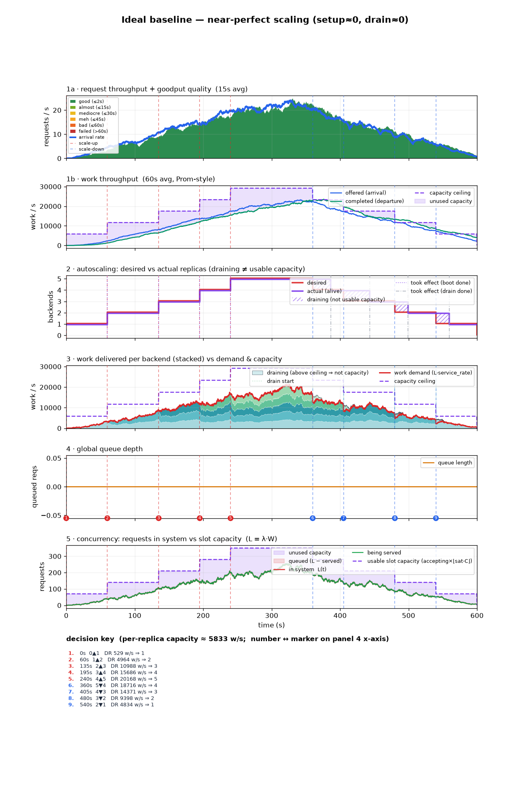

latency

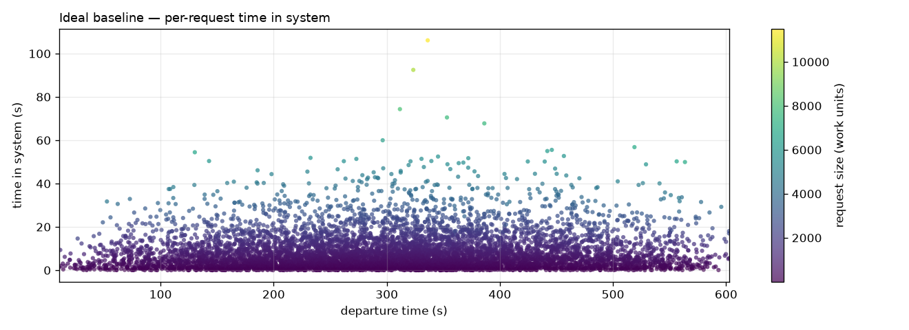

## 2 · Setup lag — same commands, 90 s boot

The **same** demand-tracking commands as ideal, landing 90 s late.
**Only ~20% served promptly** even though it still completes 100%.

> ⚠️ **Confound:** setup-lag → queue-aware changes *two* things at once — foresight lost
> (centered → trailing window) **and** a backlog-drain term added. It is not a clean A/B on
> the backlog term alone.

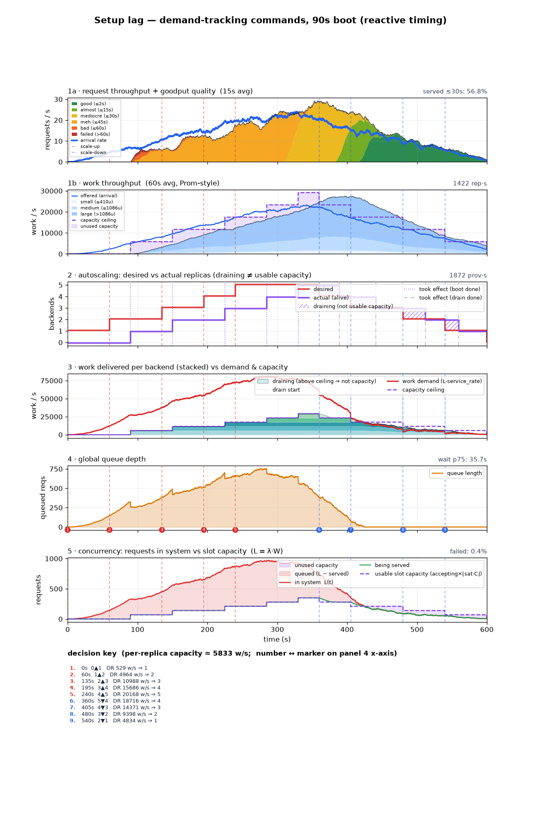

latency

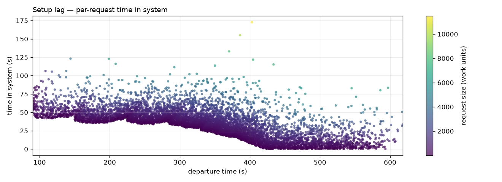

## 3 · Queue-aware — reactive backlog term

`setup=90, drain_time=30` · demand-tracking + a reactive backlog-drain term (trailing, no
look-ahead). Rescues quality only **modestly (~28% prompt)** and worsens the tail.

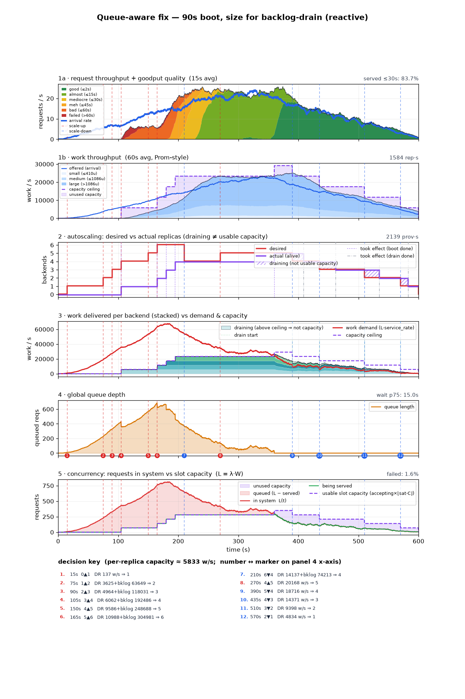

latency

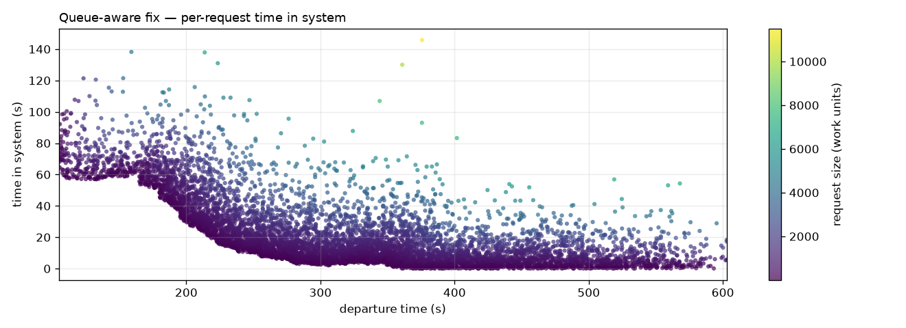

---

## 4 · HPA/KEDA queue-depth — `desired = ceil(Q)`

KEDA `AverageValue` target 1/replica. **Closed-loop**: reads the actual queue, trailing-avg
over 60 s, decides every 15 s. Blind to boot lag — during the 90 s boot it sees the whole
backlog and orders it as replicas, **pinning at `maxReplicaCount = 10`**.
**92.7% prompt, but ~2.5× the fleet (4860 rep·s)**; the cold-start backlog is the only tail.

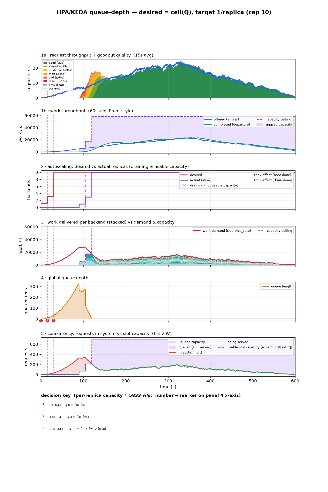

latency

## 5 · HPA/KEDA concurrency — `desired = ceil(R/c)`

KEDA `AverageValue` target `c≈58` running/replica. **Catastrophic:** the running-count signal
is capacity-capped (`R ≤ n·usable_C`), so it is **blind to the 2569-deep queue** behind it —
it stalls at 4 replicas while **88% of requests wait > 60 s**. Concurrency alone cannot
outrun boot lag.

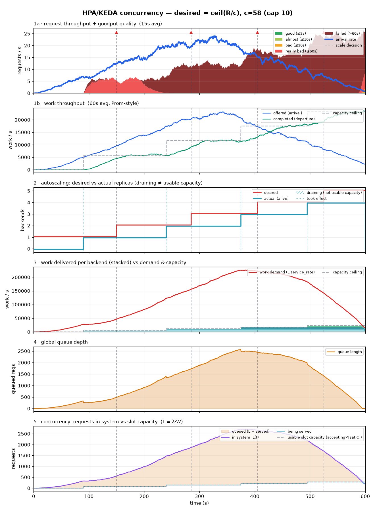

latency

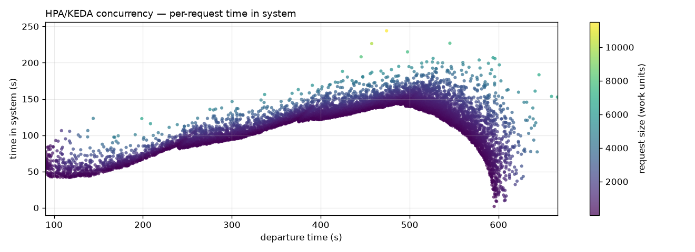

## 6 · HPA/KEDA combined — `max(queue, concurrency)`

Both triggers, native KEDA `max`: **scale up on either, down only on both**. The queue
trigger rescues the concurrency blind spot, so it **matches hpa-queue** (92.7% prompt,
4860 rep·s). This is the well-lit path's saturation + running pairing.

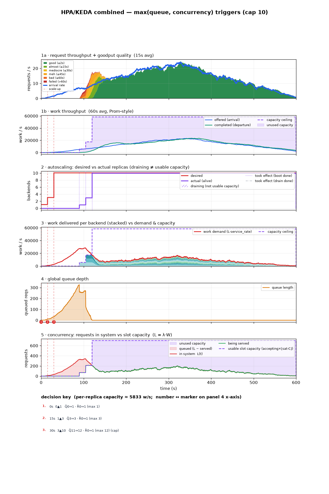

latency

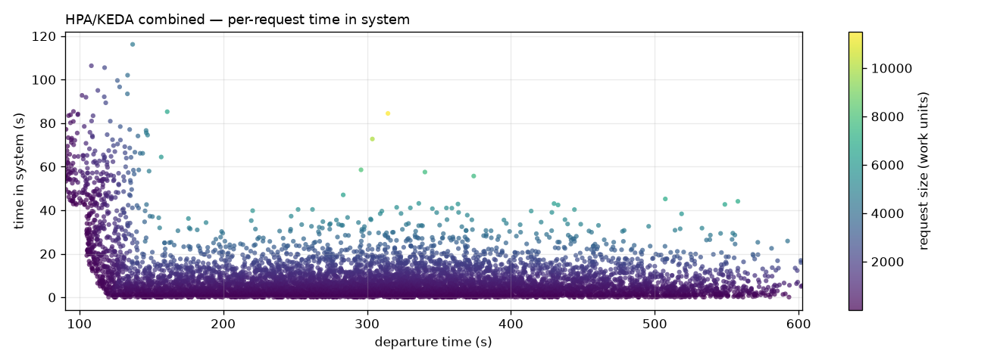

---

## Glossary

**HPA/KEDA `AverageValue` formula.** Each trigger uses a *per-replica* target, so
`desired = ceil(total_metric / per_replica_target)` and the current replica count **cancels**
— the sizer is stateless in `n`. Queue-depth target 1 → `ceil(Q)`; running-count target `c`
→ `ceil(R/c)`. These are **closed-loop**: they read the actual simulated signal,
trailing-averaged over a 60 s window (`avg_over_time`), decided every 15 s — no foresight,
purely reactive. Empty signal → **hold** at current `n` (cold start → 1); clamped to
`[minReplicaCount, maxReplicaCount] = [1, 10]`.

**KEDA multi-trigger combine (`max`).** With multiple triggers KEDA takes the **max** of each
trigger's desired count: scale **up on either**, **down only when both** agree lower. Native
behaviour, not custom logic — scenario 6 is exactly `max(ceil(Q), ceil(R/c))`. It is why the
well-lit path pairs a saturation/queue trigger with a running-count trigger: the queue trigger
covers the running-count signal's capacity-capped blind spot.

**Foresight (axis 1) — seeing future arrivals.** A *centered* window `[t−r/2, t+r/2]` averages
future arrivals into the estimate; a *trailing* window `[t−r, t]` sees only the past. This is
real foresight, and **only the clairvoyant ideal sizer has it** — no deployable controller can
see the future.

**Dead-time / setup compensation (axis 2 — NOT foresight).** Acting early enough to cover boot
lag by projecting the current queue/backlog trend forward — without peeking at future arrivals.
Orthogonal to axis 1. The KEDA baselines have neither.

**Quality bands.** Scored by absolute pre-service wait: good ≤2s / almost ≤10s / bad ≤30s /
really bad ≤60s / failed >60s. Percentages use the offered denominator, so bands + unfinished%
sum to 100.

**`C` / `sat_frac` / usable ceiling.** `C` = raw per-backend concurrency (100). `sat_frac`
(0.7) = usable fraction; a backend saturates at `⌊sat_frac·C⌋ = 70` concurrent — a stand-in for
the way real serving stops gaining goodput as concurrency climbs. Usable per-backend throughput
= `⌊sat_frac·C⌋ × service_rate`.

**`replica·seconds`.** Fleet-time consumed = area under the actual-replica curve. The cost axis:
prompt service bought with 2.5× the fleet is a real tradeoff, not a free win.
