# Autoscaling Behavioral Demo — comparison report

One request trace, several sizing approaches. **Every figure is the actual simulated execution** — a scaling *policy* only changes the supply trace; the graphs always reflect what really happened. Calibration is anchored to a real WVA decode-heavy benchmark: peak ~24 req/s, ~1000-token mean work, per-backend concurrency `C=100`, `service_rate ≈ 83` tokens/s (one backend clears ~8.3 req/s), usable ceiling `⌊0.85·C⌋ = 85` concurrent, and a **90 s replica boot** for the lagged scenarios.

> This is the static, GitHub-renderable view. The interactive version
> (tabbed compare / browse / table / glossary, with a zoom slider) lives at
> [`out/index.html`](out/index.html) — open it locally; GitHub strips its JS/CSS.
> Rebuild everything with `python run.py && python report.py`.

**Every scenario completes 100% of requests.** The story is *not* completion — it is the **waiting-time quality mix** (how prompt service was) and the **cost** (`replica·seconds` of fleet-time). A policy can "finish everything" and still be terrible, or be perfectly prompt and burn 3× the fleet.

---

## The story in one table

Quality rows are the **cumulative** share of offered requests served *within* each wait bound (the wait CDF sampled at 2 / 15 / 45 / 60 s); cost is fleet-time.

| metric | ideal | static | setup-lag | queue-aware | qexp | hpa-queue | hpa-concurrency | hpa-combined |
|---|---|---|---|---|---|---|---|---|
| ≤2s % | 100.0 | 100.0 | 31.0 | 33.6 | 38.3 | 81.7 | 12.7 | 81.7 |
| ≤15s % | 100.0 | 100.0 | 44.4 | 79.4 | 69.0 | 90.5 | 20.0 | 90.5 |
| ≤45s % | 100.0 | 100.0 | 98.8 | 91.4 | 95.3 | 100.0 | 51.9 | 100.0 |
| ≤60s % | 100.0 | 100.0 | 99.5 | 98.8 | 98.8 | 100.0 | 70.5 | 100.0 |
| unfinished | 0 | 0 | 0 | 0 | 0 | 0 | 0 | 0 |
| wait avg (s) | 0.0 | 0.0 | 16.2 | 11.8 | 11.0 | 3.1 | 39.4 | 3.1 |
| wait p95 (s) | 0.0 | 0.0 | 38.9 | 52.4 | 42.6 | 25.6 | 62.2 | 25.6 |
| replicas max | 5 | 10 | 4 | 4 | 5 | 10 | 4 | 10 |
| replica·seconds | 1755 | 6000 | 1306 | 1373 | 1461 | 2788 | 1298 | 2788 |
| provisioned·seconds | 1755 | 6000 | 1741 | 1928 | 2091 | 3598 | 1628 | 3598 |
| utilization | 0.59 | 0.17 | 0.79 | 0.75 | 0.70 | 0.37 | 0.79 | 0.37 |

Readings: the **ideal** clairvoyant sizer is the only one that sees future arrivals — 100% prompt at the lowest real cost, the reference everything else is measured against. **No scaling** is also 100% prompt but pins at the max and burns ~3.5× the ideal fleet at the lowest utilisation (0.17) — promptness bought by paying for peak through every valley. **Setup-lag → queue-aware → Qexp** is the deployable-sizer progression under 90s boot: a correct policy landing 90s late is only ~36% prompt (≤2s); adding a **reactive** backlog term (queue-aware, drain_time=20) barely moves promptness — 33% ≤2s, roughly flat — lifting only the ≤15s share (55%→72%) while worsening the p90 tail (32s→40s), because it chases the queue after the pile-up. **Qexp** — the same backlog-drain idea but **anticipatory**, sizing to the projected backlog peak — is the breakthrough: **78% prompt** (≤2s), 89% within 15s, p90 17.6s, at essentially the same fleet cost as reactive queue-aware (1920 vs 1872 prov·s). Anticipation, not extra capacity, is what buys the quality. Among the fleet-heavy KEDA options, **hpa-combined** is prompt (77% ≤2s, 95% within 15s) and **hpa-queue** middling (64% ≤2s, a 6.6% failed tail), both at ~1.8–1.9× the ideal fleet. **hpa-concurrency** is catastrophic — 74% wait over a minute — because its signal is capacity-capped and blind to the queue; the KEDA `max` in **hpa-combined** is what rescues that blind spot.

Full metrics table (all rows)

| metric | ideal | static | setup-lag | queue-aware | qexp | hpa-queue | hpa-concurrency | hpa-combined |
|---|---|---|---|---|---|---|---|---|
| offered | 7188 | 7188 | 7188 | 7188 | 7188 | 7188 | 7188 | 7188 |
| completed | 7188 | 7188 | 7188 | 7188 | 7188 | 7188 | 7188 | 7188 |
| completed % | 100.0 | 100.0 | 100.0 | 100.0 | 100.0 | 100.0 | 100.0 | 100.0 |
| unfinished | 0 | 0 | 0 | 0 | 0 | 0 | 0 | 0 |
| ≤2s % | 100.0 | 100.0 | 31.0 | 33.6 | 38.3 | 81.7 | 12.7 | 81.7 |
| ≤15s % | 100.0 | 100.0 | 44.4 | 79.4 | 69.0 | 90.5 | 20.0 | 90.5 |
| ≤30s % | 100.0 | 100.0 | 85.2 | 86.8 | 91.8 | 97.0 | 27.1 | 97.0 |
| ≤45s % | 100.0 | 100.0 | 98.8 | 91.4 | 95.3 | 100.0 | 51.9 | 100.0 |
| ≤60s % | 100.0 | 100.0 | 99.5 | 98.8 | 98.8 | 100.0 | 70.5 | 100.0 |
| failed (>60s) % | 0.0 | 0.0 | 0.5 | 1.2 | 1.2 | 0.0 | 29.5 | 0.0 |
| wait avg (s) | 0.0 | 0.0 | 16.2 | 11.8 | 11.0 | 3.1 | 39.4 | 3.1 |
| wait p50 (s) | 0.0 | 0.0 | 18.7 | 6.7 | 8.2 | 0.0 | 41.8 | 0.0 |
| wait p75 (s) | 0.0 | 0.0 | 27.0 | 11.1 | 16.8 | 0.0 | 60.3 | 0.0 |
| wait p90 (s) | 0.0 | 0.0 | 34.7 | 42.7 | 21.0 | 14.2 | 61.7 | 14.2 |
| wait p95 (s) | 0.0 | 0.0 | 38.9 | 52.4 | 42.6 | 25.6 | 62.2 | 25.6 |
| wait p99 (s) | 0.0 | 0.0 | 47.6 | 62.6 | 62.6 | 34.4 | 63.1 | 34.4 |
| time/work avg (s/u) | 0.01 | 0.01 | 0.16 | 0.11 | 0.11 | 0.03 | 0.51 | 0.03 |
| time/work p50 (s/u) | 0.01 | 0.01 | 0.03 | 0.02 | 0.02 | 0.01 | 0.06 | 0.01 |
| time/work p90 (s/u) | 0.01 | 0.01 | 0.16 | 0.11 | 0.11 | 0.03 | 0.40 | 0.03 |
| time/work p95 (s/u) | 0.01 | 0.01 | 0.32 | 0.24 | 0.22 | 0.06 | 0.77 | 0.06 |
| time/work p99 (s/u) | 0.01 | 0.01 | 1.93 | 1.21 | 1.07 | 0.32 | 4.70 | 0.32 |
| replicas avg | 2.92 | 10.00 | 2.18 | 2.29 | 2.43 | 4.65 | 2.16 | 4.65 |
| replicas std | 1.40 | 0.18 | 1.36 | 1.36 | 1.53 | 2.91 | 1.09 | 2.91 |
| replicas max | 5 | 10 | 4 | 4 | 5 | 10 | 4 | 10 |
| replica·seconds | 1755 | 6000 | 1306 | 1373 | 1461 | 2788 | 1298 | 2788 |
| provisioned·seconds | 1755 | 6000 | 1741 | 1928 | 2091 | 3598 | 1628 | 3598 |
| boot-lag waste·s | 0 | 0 | 435 | 555 | 630 | 810 | 330 | 810 |
| utilization | 0.59 | 0.17 | 0.79 | 0.75 | 0.70 | 0.37 | 0.79 | 0.37 |

---

## Cost & waiting-time tradeoffs (reference: bump)

Two cross-policy views on one axis — the full waiting-time CDF and the cost-vs-quality frontier — on the calibration **bump** shape.

**Cost vs quality — the Pareto frontier.** x = billed fleet-time (provisioned·seconds, the cost); y = promptness (% of offered served within 15s). The dashed line is the frontier over the **deployable** policies — anything below-and-right of it is dominated (something is both cheaper AND prompter). **ideal** is drawn apart as the clairvoyant reference (not deployable). This is where “same cost, better quality” becomes literal — on the reference **bump**: **setup-lag → queue-aware(1.3) → Qexp(1.3)** trace the frontier's steep left wall — each Pareto-optimal, a little more fleet-time for a lot more promptness — with Qexp the standout (89% within 15s at essentially queue-aware's cost). The extra hollow points are the two Q sizers swept to **headroom 1.5 and 2.0**: queue-aware climbs but every one of its points stays *below* Qexp, and both sizers' high-headroom variants are dominated by Qexp(1.3) — buying static margin costs real fleet-time for little extra quality, whereas anticipation is near-free. The fleet-heavy KEDA points (hpa-queue/combined) sit far to the right at ~2.5–3× the cost. The sustained shapes below stress this differently — read each shape's own frontier.

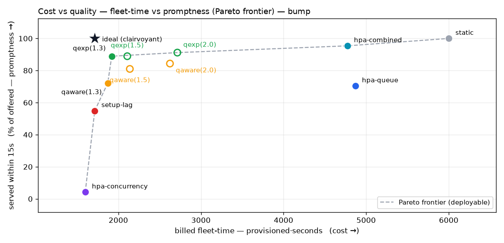

**Waiting-time CDF — all policies on one axis.** Each curve is a policy's **wait CDF over the OFFERED denominator**: height at time *t* = share of all arrivals served within *t* s. Curves that asymptote **below 100%** stranded work (unfinished). Read left-to-right: the further up-and-left, the prompter. Legend carries each policy's billed fleet-cost, so promptness and cost read together. This is the same data as the Table's “≤Ns %” rows, shown continuously.

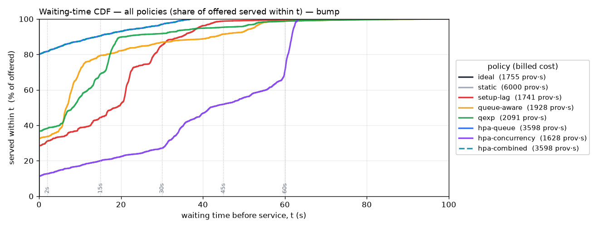

---

## Demand shapes

The same eight policies over five demand shapes. **bump** is the calibration reference; **trapezoid / step up / step down** stress sustained load and scale-down; **spike** is a teaching case (autoscaling is the wrong tool for a 6 s burst). Each panel is that shape's cost-vs-quality frontier; open [`out/index.html`](out/index.html) for the full per-shape galleries, waiting-time CDFs, and metric tables.

**Bump** — a smooth triangular rise-and-fall (0 → peak → 0), the **calibration/reference** shape. Every constant (`drain_time=20`, `proj_setup=120`, `headroom=1.3`) is tuned here and the fleet fully drains at both ends. All narrative numbers in the Compare/Table prose are this shape's reference values.

**Trapezoid** — ramp up to a *sustained plateau* at peak, then ramp down, over a low floor (≈ peak/3). Stresses the sizers in long steady-state, not just a transient — the anticipation vs reaction gap shows on both the up-ramp and the hold.

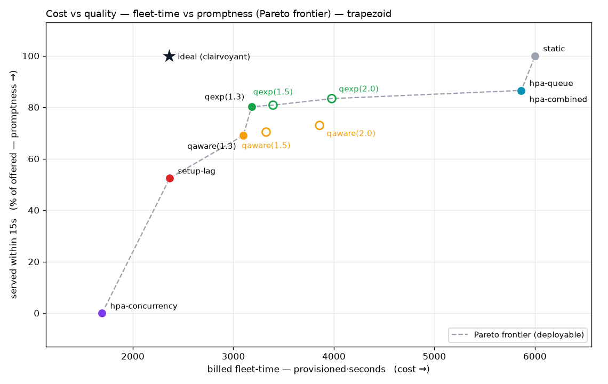

**Step up** — an abrupt jump from a low floor to a *sustained high plateau that never recedes*. Stresses how fast each policy closes the gap after a step and where it settles.

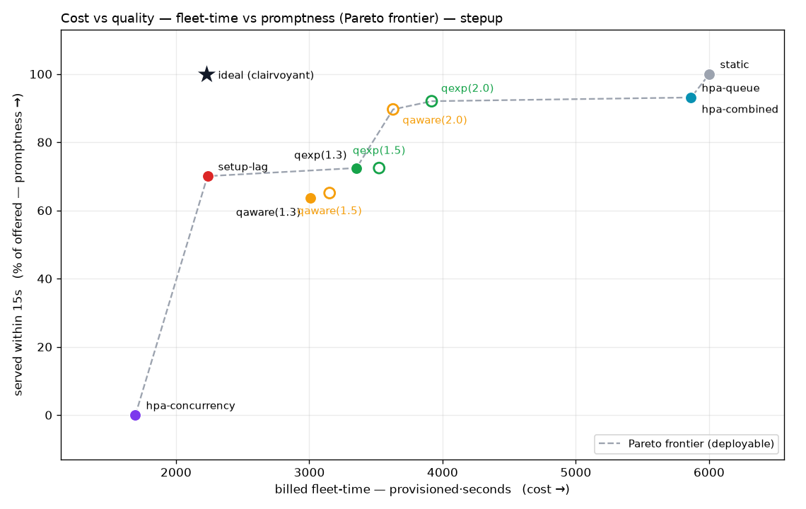

**Step down** — starts high, drops to a *sustained low floor*. Stresses scale-**down** discipline: how much fleet-time each policy wastes before releasing capacity it no longer needs (the uncapped WVA desired peaks are highest on this shape — the reason the actuation cap matters most here).

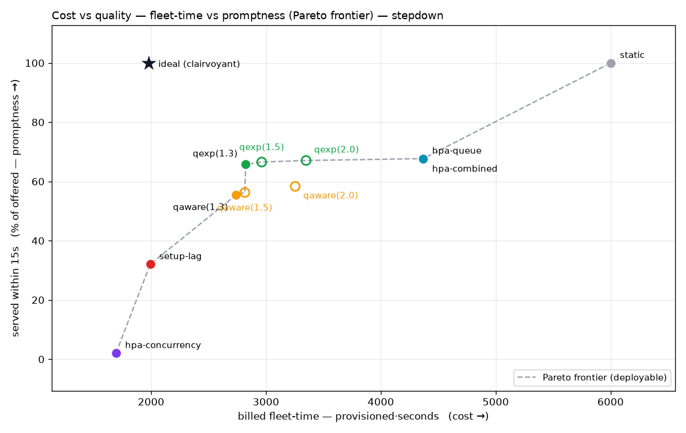

**Spike — a teaching case, NOT a calibration shape.** A ~6-second burst to 3× peak, far shorter than the 90 s replica boot. The bottleneck here is **boot lag, not the sizing algorithm**: by the time an ordered replica finishes booting, the burst is long over. So every *achievable* policy that must spin up capacity — reactive, anticipatory, and both KEDA baselines — drops **between 7% and 57%** of requests. The clairvoyant **ideal** line *does* survive (0% failed), but only because it boots instantly — a fiction no real cluster gets. The one real policy that absorbs the burst cleanly is **No scaling** pinned at the max: 0% failed, because the replicas are already warm — paid for with ~5× the steady-state resource-seconds and ~14% utilisation the rest of the time. The lesson: for a burst shorter than your boot time, autoscaling is the *wrong tool* — only standing pre-provisioned headroom absorbs it, and that headroom is exactly what you pay to be spike-proof. Exact numbers are in the per-shape Table.

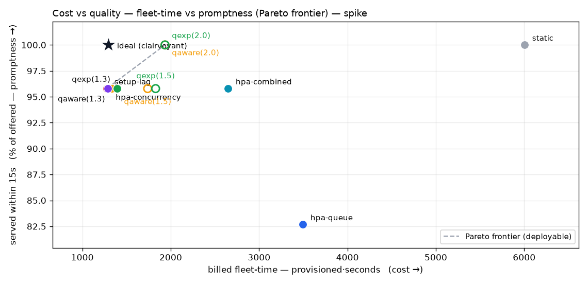

---

## Scenarios (reference: bump)

### 1 · Ideal

*setup=0 · size to CENTERED demand rate (DR) × headroom (clairvoyant)*

what does good look like? → 100% served ≤2s; never queues on a smooth bump

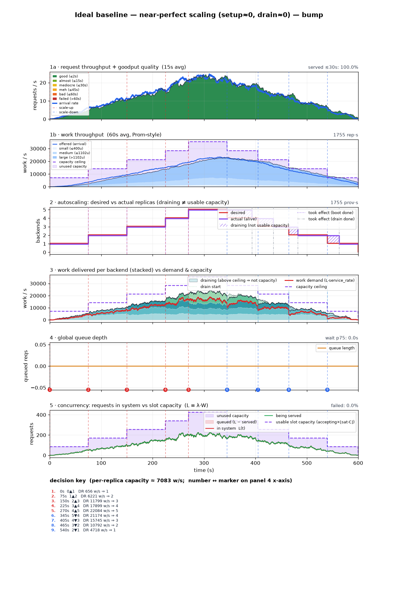

latency

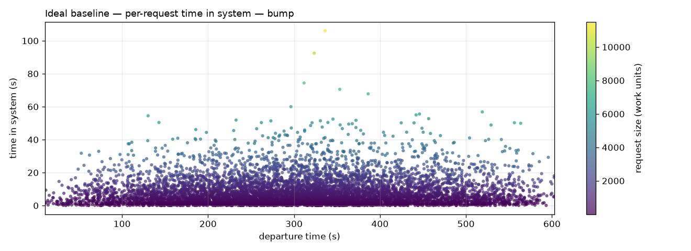

### 2 · No scaling

*fixed fleet pinned at the shape's maxReplicaCount for the whole run · no autoscaler, pre-warmed (setup=0)*

what if you just provision for max and never scale? → 100% prompt (never queues on this bump), but the most expensive fleet (6001 rep·s ≈ 3.5× ideal) at the lowest utilisation (0.17) — promptness bought by paying for peak capacity through every valley

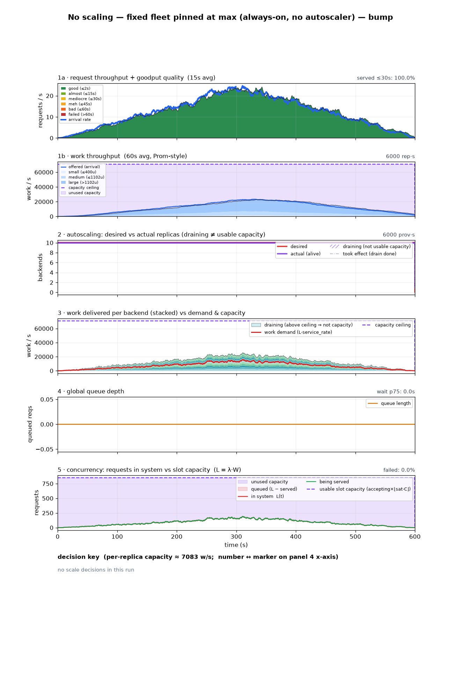

latency

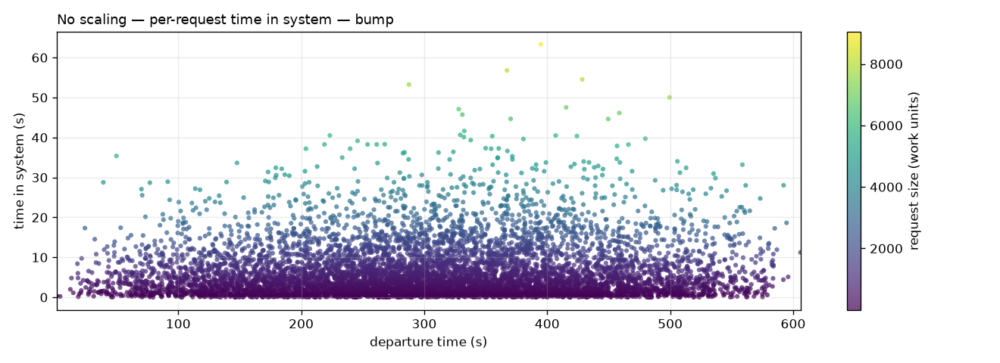

### 3 · Setup lag

*setup=90 · the SAME demand-tracking commands as ideal, landing 90s late*

does a correct policy survive 90s boot lag? → still completes 100%, but only ~36% served promptly (≤2s) and a 32s p90 wait. ⚠ confound: setup-lag→queue-aware changes TWO things at once (foresight lost, centered→trailing window, AND a backlog-drain term added) — not a clean A/B on the backlog term alone

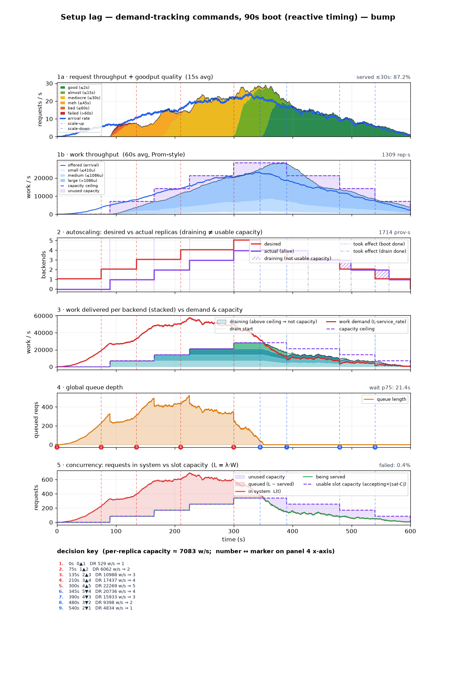

latency

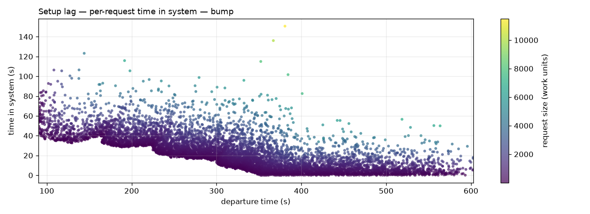

### 4 · Queue-aware

*setup=90, drain_time=20 (the level-field backlog-drain deadline, shared with Qexp) · demand-tracking + backlog-drain (reactive, TRAILING)*

can a reactive backlog term rescue quality? → barely on promptness — 33% served ≤2s, roughly flat vs setup-lag's 36% — though it does lift the ≤15s share (55%→72%); and it worsens the p90 tail (32s→40s), chasing the backlog only after it has piled up during the boot. Reacting isn't enough — this is what motivates anticipation, see Qexp

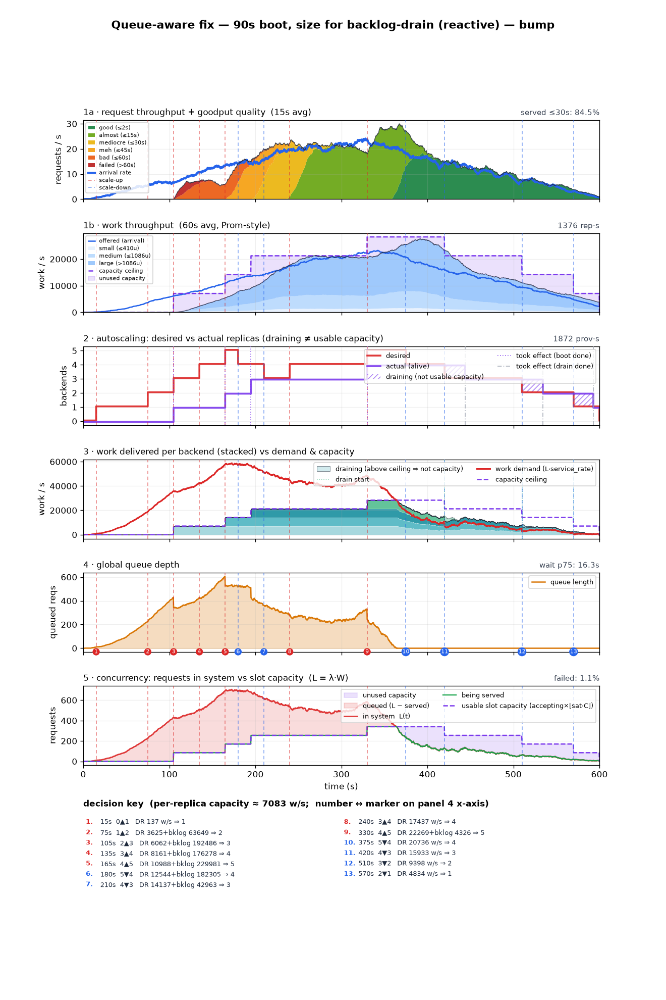

latency

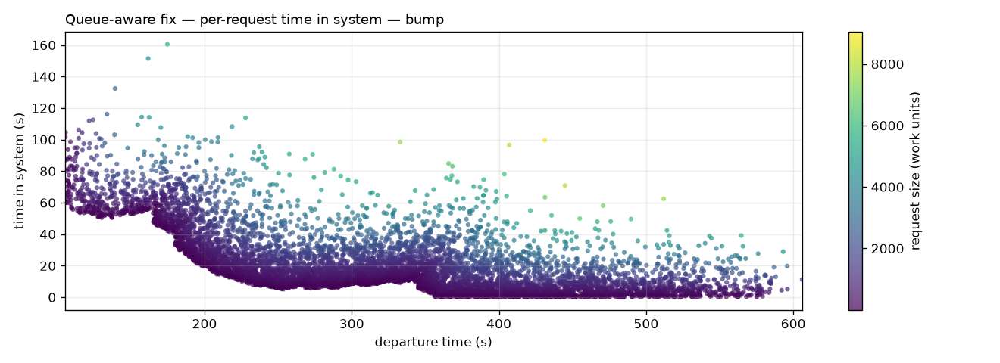

### 5 · Qexp (anticipatory)

*setup=90, drain_time=20, proj_setup=120 · anticipatory: a PERIODIC control loop that sizes to the backlog PEAK projected over the committed boot schedule (up now + pending at their estimated land-times), assuming a 120s boot lead (over-anticipates the true 90s). Reads only the observable queue LEVEL — no foresight of arrivals*

does anticipating the boot-window pile-up help? → decisively. Qexp serves 78% promptly (≤2s) vs reactive queue-aware's 33%, at essentially the same fleet cost (1920 vs 1872 prov·s, +3%), with a far shorter tail (p90 17.6s vs 40.2s) and a lower queue peak (428 vs 607). It orders sooner and HOLDS through the boot instead of chasing the queue after the fact — anticipation, not extra capacity, is what buys the quality. Still no foresight: it only projects the CURRENT queue forward (axis-2 dead-time compensation, not axis-1)

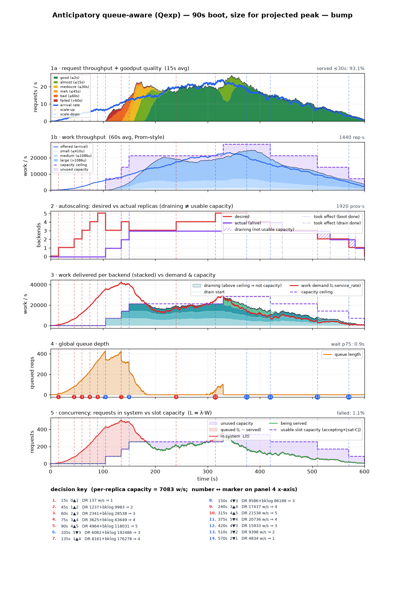

latency

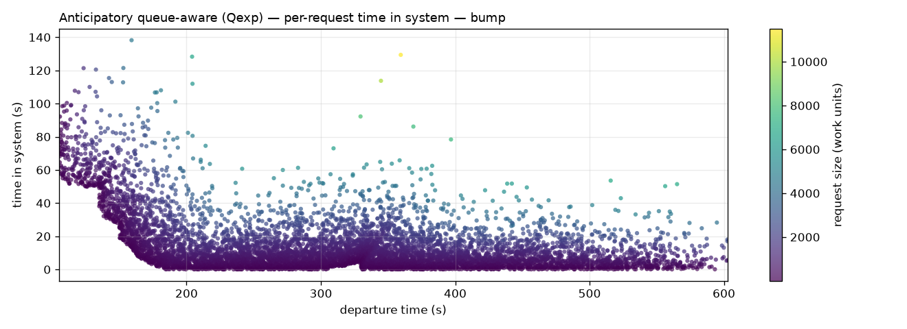

### 6 · HPA queue

*KEDA queue-depth · AverageValue target=1/replica → desired=ceil(Q) · setup=90, clamped to the shape's cap*

naive queue-depth scaling (target 1)? → 64% prompt with a real slow tail (6.6% failed, p90 52.6s); pins at the maxReplicaCount=10 cap and still burns ~1.8× the ideal fleet (3159 vs 1714 rep·s) — the cold-start backlog dominates the tail

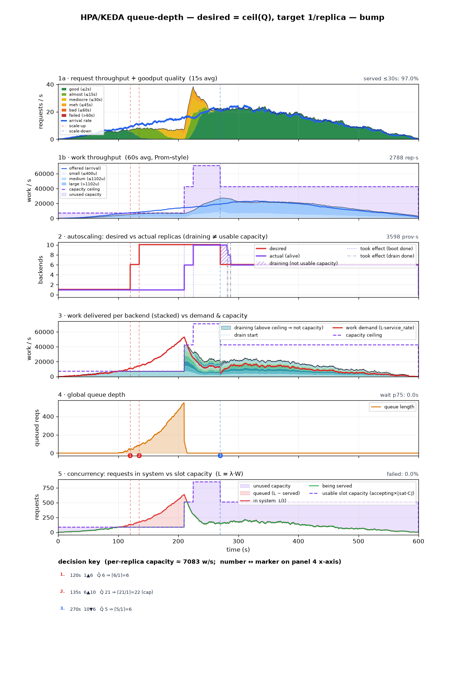

latency

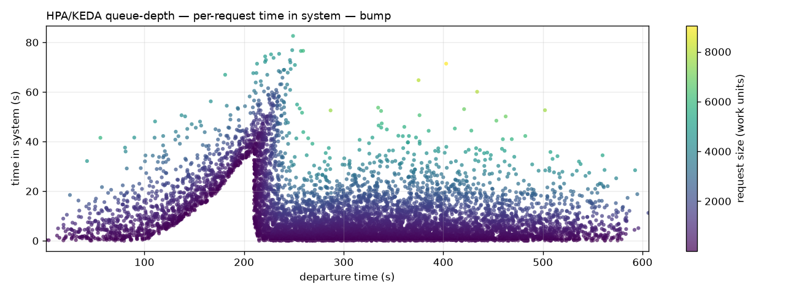

### 7 · HPA concurrency

*KEDA running-count · AverageValue target c≈58/replica → desired=ceil(R/c) · setup=90, clamped to the shape's cap*

concurrency-only scaling? → catastrophic: the running-count signal is capacity-capped (R ≤ n·usable_C), so it is BLIND to the 2004-deep queue behind it, stalls at 4 replicas, 74% wait >60s. Concurrency alone cannot outrun boot lag

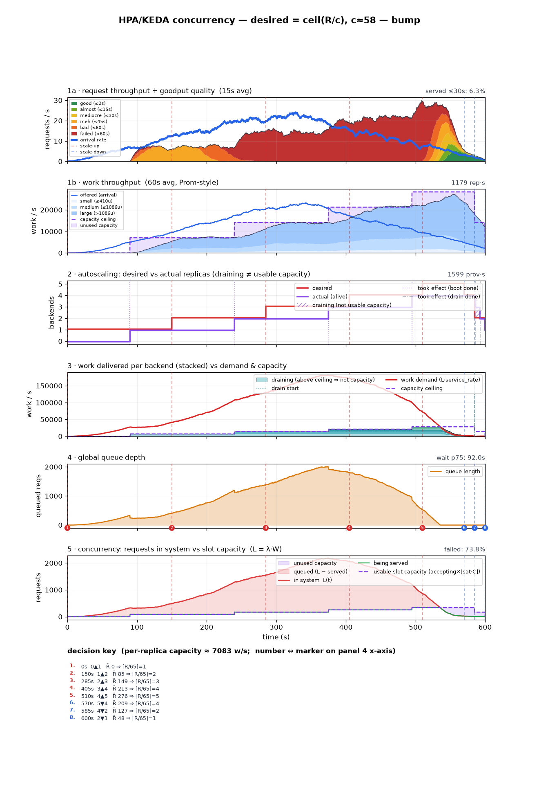

latency

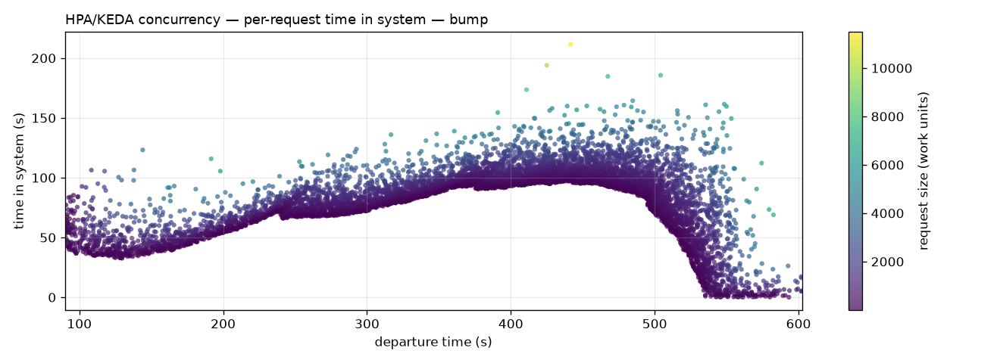

### 8 · HPA combined

*KEDA both triggers · desired=max(queue, concurrency) · up on either, down on both · setup=90, clamped to the shape's cap*

combining the two triggers (native KEDA max)? → the queue trigger rescues the concurrency blind spot; now the best-served fleet-heavy option (77% ≤2s, 95% ≤15s, p90 4.5s) at ~1.9× the ideal fleet (3242 rep·s), slightly beating queue-depth alone — the well-lit path's saturation+running pairing

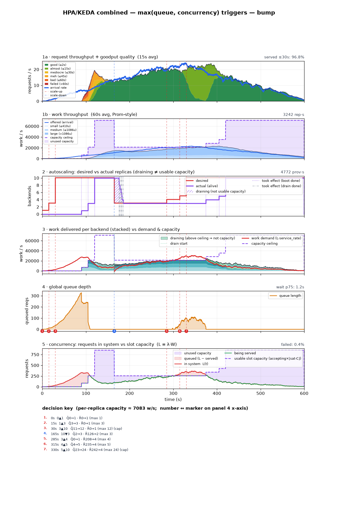

latency

---

## Parameter sweeps

Trend + calibration line-plots (full numeric tables in [`out/sweep.md`](out/sweep.md)). The six knob sweeps all run on the **bump** reference shape (only the knob varies); the **Cap sweep** figures below vary the demand shape and name it in each title. Solid = good %, dashed = wait p90, dotted vertical = baseline.

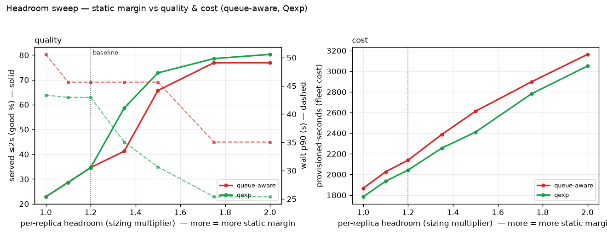

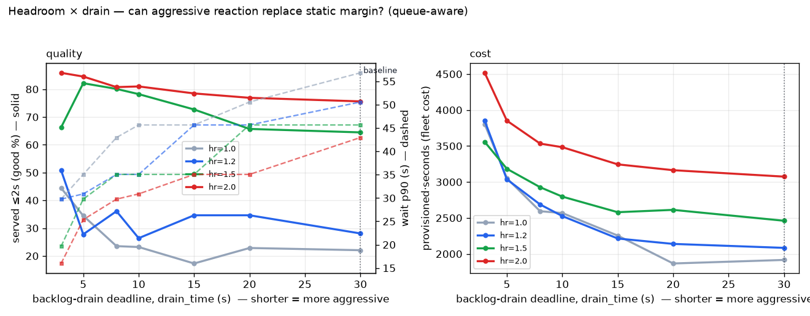

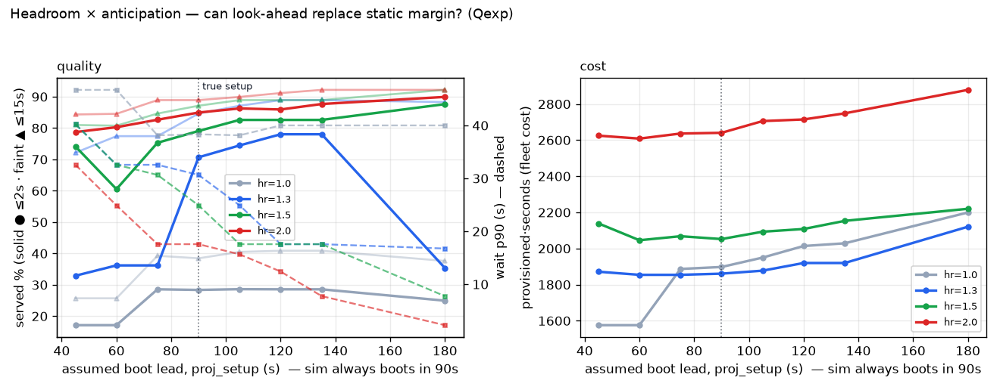

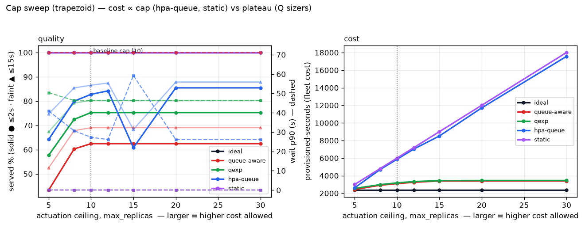

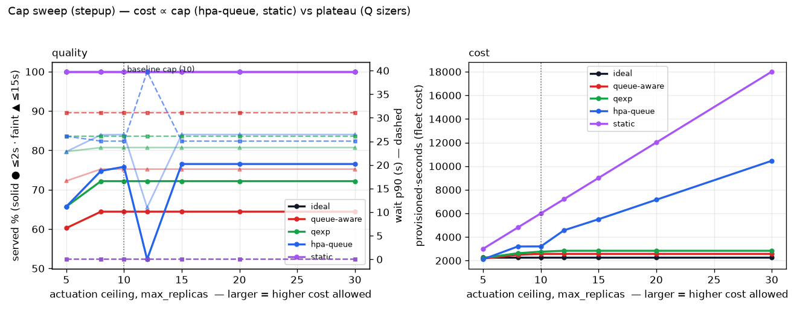

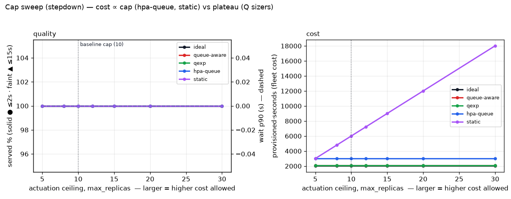

---

## Glossary

**range vs interval.** A **range** is a lookback span (how far back a windowed average reaches, PromQL `metric[5m]`); an **interval** is a cadence (how often something recomputes/samples). Independent: average over 60s, decide every 15s.

**the three meanings of “rate”.** **service_rate** = tokens/s one in-service request advances at (a backend property, fixed). **DR** (demand rate) = arrival_rate × E[size], tokens/s — a demand ESTIMATE, not a measurement. **measured throughput** = observed arrival/departure counts per second. Three different quantities the word “rate” gets loosely attached to; only measured throughput is one you actually observe directly.

**DR — demand rate (was OWR).** DR(t) = arrival_rate(t) × E[size], in **tokens/s** — the offered *work* rate, not requests/s (each request's work/size varies, so demand is measured in tokens). An **estimate**, not a measurement: arrival count is observable but a request's work (size) is not known at arrival. Valid as a proxy only under the **stationary-shape assumption** — arrival rate varies over time, the size distribution does not. (Named `owr` in the code / trace files.)

**C / sat_frac / usable ceiling.** **C** = raw per-backend concurrency limit (100 here). **sat_frac** = usable fraction (0.85); a backend saturates at the **usable ceiling** ⌊sat_frac·C⌋ = 85 concurrent, a flat stand-in for the way real serving (vLLM) stops gaining goodput as concurrency climbs. Usable per-backend throughput = ⌊sat_frac·C⌋ × service_rate.

**headroom.** Scale-up utilization target. headroom=1.3 sizes for ~1/1.3 ≈ 77% utilization, leaving slack for noise. Raw-hardware utilization ≈ sat_frac/headroom ≈ 0.85/1.3 ≈ 65%.

**sizing_range / decision_interval / drain_time.** **sizing_range** (60s) = the lookback the sizer averages DR over. **decision_interval** (15s) = how often it recomputes the desired count. **drain_time** = the deadline over which the backlog term aims to clear the current queue; used by both backlog-drain sizers at the same **20s** — a deliberate level-field rule (2026-08-05) so queue-aware and Qexp compare on identical drain aggression and only the reactive-vs-anticipatory difference shows.

**setup / drain.** **setup** = boot lag, start→up (dead time; 90s for the lagged scenarios). **drain** = drain time, stop→down.

**foresight — seeing future arrivals (axis 1).** Whether a sizer can see arrivals that haven't happened yet. A **centered** window [t−r/2, t+r/2] averages future arrivals into the estimate; a **trailing** window [t−r, t] sees only the past. This is real foresight, and **only the clairvoyant ideal sizer has it** — no deployable controller can see the future. This is the one axis that separates the ideal from every real strategy.

**setup / dead-time compensation (axis 2 — NOT foresight).** Whether a sizer acts early enough to cover boot lag: it must aim at the demand it will face at t+setup and credit the replicas already booting, so it doesn't re-order the same backlog every interval (integral windup). A **real** controller does this WITHOUT foresight — by projecting the current queue/backlog trend forward, not by peeking at future arrivals. **Qexp** (the anticipatory scenario, built) is exactly this: no axis-1 foresight, only axis-2 dead-time compensation. Orthogonal to axis 1 — a sizer can have either, both, or neither.

**Qexp — the anticipatory queue-aware sizer.** A **periodic control loop** (the `08-queue-aware-exp` scenario). Each tick it re-reads the observable state — backlog level, up capacity, and the replicas already booting with their estimated land-times — and rolls the backlog forward under that committed boot schedule. It sizes to the **PEAK** of that projected backlog (not the backlog measured now, and not its eventual residual), so it orders enough to cover the pile-up that WILL accumulate during the boot and then HOLDS through the boot instead of chasing the queue after the fact. Same backlog-drain idea as reactive queue-aware; the difference is projecting forward vs measuring now. No axis-1 foresight — it never sees future arrivals.

**observability wall.** The real system exposes only the queue **LEVEL** (depth right now), never per-request departures or per-batch drain rates. So a sizer cannot track individual cohorts through the queue — it can only read the current level and react. Qexp respects this: it projects the CURRENT level forward and drives scale-down off the OBSERVED backlog dropping, not off a modelled departure schedule. This is what keeps it deployable rather than a paper policy.

**proj_setup — the conservatism dial.** The boot lead the projection ASSUMES (distinct from `setup`, the boot lag the sim actually applies). Under-predict (proj_setup &lt; setup) → the loop anticipates less and drifts toward reactive; over-predict (&gt; setup) → it orders earlier and trades a little cost for a shorter tail. Crucially the loop is **self-correcting**: because it re-observes the true level every tick, it stays stable across the whole range and never DEPENDS on the assumption being right — proj_setup just tunes how conservative it is. In the sweep at headroom=1.3, **good% climbs as you over-predict** (70.7% at the honest 90 → 78% on a broad plateau around 120–135) and only **collapses if you over-predict too far** (35% at 180 — the projection orders so early it flaps); tail p90 improves across the same plateau. So it is a promptness-vs-tail-vs-cost knob with a wide safe band (the demo runs proj_setup=120), not a correctness knob.

**quality bands.** Requests are scored by ABSOLUTE pre-service wait (not slowdown ratio): good ≤2s / almost ≤15s / mediocre ≤30s / meh ≤45s / bad ≤60s / failed >60s (good and failed pinned; the 2–60s middle is an even ramp). Percentages use the OFFERED denominator so bands + unfinished% sum to 100. The Table's **“≤Ns %” rows** and the **wait-CDF** figure show the same data **cumulatively** (share served *within* each bound, so each row climbs toward 100%); the stacked panel-1a figure shows the **exclusive** per-band shares. failed% = 100 − (≤60s %) − unfinished%.

**goodput.** Throughput that actually meets the latency bar. Real serving throughput can keep rising while goodput collapses past a concurrency knee — which is why sat_frac caps the USABLE ceiling below raw C.

**HPA/KEDA AverageValue formula.** The `04/05/06-hpa-*` scenarios are the well-lit KEDA path. Each trigger uses **metricType: AverageValue** (a per-replica target), so `desired = ceil(total_metric / per_replica_target)` and the current replica count **cancels out** — the sizer is stateless in n. Queue-depth target 1 → `ceil(Q)`; running-count target c → `ceil(R/c)`. These are **closed-loop**: they read the ACTUAL simulated queue/running signal, trailing-averaged over a 60s window (`avg_over_time`), decided every 15s — no foresight, purely reactive. Empty signal → **hold** at current n (cold start → 1); clamped to **[minReplicaCount, maxReplicaCount]** = [1, 10].

**KEDA multi-trigger combine (max).** With multiple triggers KEDA takes the **max** of each trigger's desired count: scale **up on either**, **down only when both** agree lower. This is native behaviour, not custom logic — the `06-hpa-combined` scenario is exactly `max(ceil(Q), ceil(R/c))`. It is why the well-lit path pairs a saturation/queue trigger with a running-count trigger: the queue trigger covers the running-count signal's capacity-capped blind spot (see 05).
