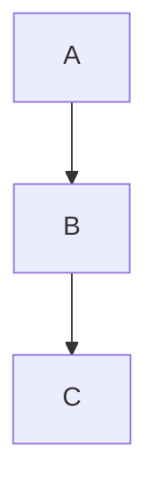

spec as code
========

I am looking for tools and best practices for managing my code as spec docs.
I am using AI agents to code (and also to create docs). These agents are already doing almost all actual coding. I typically monitor and review. 

I want to move to a different workflow and asset management.
I want to manage higher level spec as the "code". 
I still want it to be very close to the actual code -- something like pseudo-code.
Beyond pseudo-code I want to have the data flow, failure paths, components, etc. 
Maybe this can be expressed as simplified UML.
The idea is to have a spec that defines all aspects of implementation, except the code itself.
Any coding agent should be able to follow this spec as very accurate desired outcome.
On the other hand, this should not replace the md files that direct a coder on the coding plan and task plan -- these direction are still needed to define a particular coding task, rules, coding conventions, style, etc. The spec is meant to live alongside the planning docs and along side the code. Probably managed and tracked using git.  It is not a spec for a particular task but rather the code at a higher level.

My ultimate goal is to move just a little bit up the stack. use this spec as my new hl coding language, which I can review, write, test logically, etc. 

10y ago, I remember tools that allowed you to design a system as components and then use code generators for the actual code. There were other tools that allowed you to assign implementation tasks to a (human) coder with clear boundaries, clear interfaces, and very clear tasks. Now, when using an AI coder, we can have the spec higher level, but still structured and with clear interactions and functionality. Ideally, also support modern software engineering like object oriented, inheritence, design pattern -- all at a higher, more abstract level.

I am looking for a framework.
I am also looking for tools that would take existing code and convert it to this higher spec. Probably using an AI agent.

------------------

What you're describing is very close to a trend that is emerging around **"spec-driven development"** or **"architecture-as-code"**, but there is not yet a dominant framework analogous to Git for source code.

The interesting thing is that AI changes the economics.

Traditional MDA/UML/codegen failed because:

* Humans hated maintaining diagrams and code separately.
* Generated code was hard to customize.
* Specs inevitably drifted from implementation.

With AI agents, the spec no longer needs to generate code mechanically. It only needs to be precise enough that an agent can regenerate or modify code correctly.

That lowers the required fidelity enormously.

---

# What I think you are actually looking for

Not:

```
spec -> code generator -> code
```

but:

```
spec -> AI coder -> code
```

where the spec is:

* version controlled
* reviewable
* diffable
* composable
* partially executable
* understandable by humans
* understandable by AI

This is fundamentally different from UML.

---

# The stack I would explore today

Think of the spec as several layers.

## Layer 1: Architecture

Defines components and ownership.

Example:

```yaml
service: scheduler

components:
  - job_queue
  - autoscaler
  - metrics

dependencies:
  autoscaler:
    uses:
      - metrics
      - job_queue
```

AI agents understand this surprisingly well.

---

## Layer 2: Data Flow

Something like:

```yaml
request:
  submit_job:
    input:
      - user_id
      - job_spec

    flow:
      - validate
      - enqueue
      - persist
      - emit_metric

    failures:
      validation:
        return: 400

      queue_full:
        return: 503
```

This is where most systems fail.

You explicitly specify:

* happy path
* failure paths
* retries
* idempotency

---

## Layer 3: State Machines

This is hugely valuable and underused.

Instead of code:

```python
if state == RUNNING:
```

write:

```yaml
states:
  PENDING:
    transitions:
      - RUNNING
      - FAILED

  RUNNING:
    transitions:
      - SUCCESS
      - FAILED
```

AI agents follow these very reliably.

---

## Layer 4: Contracts

Interface definitions.

This already exists.

Examples:

* OpenAPI
* GraphQL schema
* protobuf
* AsyncAPI

These are arguably successful examples of "spec as code."

---

## Layer 5: Behavioral Rules

Example:

```yaml
autoscaling:

  scale_up:
    if:
      queue_depth > 100

  scale_down:
    if:
      queue_depth < 20

  cooldown:
    60s
```

This is nearly executable.

---

# Existing frameworks worth studying

## OpenAPI

Most successful spec-as-code system ever built.

Not because of REST.

Because:

* versioned
* reviewable
* machine readable
* human readable
* code generation possible

AI agents understand OpenAPI extremely well.

---

## AsyncAPI

Same idea for event systems.

Useful if you work with:

* Kafka
* queues
* pub/sub

AsyncAPI

---

## C4 Model

My favorite architecture documentation system.

Instead of UML.

Levels:

1. Context
2. Container
3. Component
4. Code

The sweet spot is component level.

AI understands C4 surprisingly well.

Structurizr

---

## Structurizr

Architecture-as-code.

Example:

```dsl
container api
container worker

api -> worker "submits jobs"
```

Produces diagrams automatically.

Probably closest to what you describe.

Structurizr

---

## D2

Diagram-as-code.

Far better than UML.

Example:

```d2
api -> queue
queue -> worker
worker -> database
```

Generates diagrams automatically.

D2

---

## PlantUML

Older but still useful.

Especially sequence diagrams.

```plantuml
User -> API
API -> Queue
Queue -> Worker
```

AI can generate and update these easily.

PlantUML

---

# Reverse engineering existing code

This is where AI changes everything.

Historically:

```
code -> UML
```

was terrible.

Now:

```
code -> AI -> spec
```

works surprisingly well.

For existing systems I would build a pipeline:

```text
Source code
    ↓
AST extraction
    ↓
Dependency graph
    ↓
LLM summarization
    ↓
Spec files
```

Tools that help:

* [Sourcegraph](https://sourcegraph.com?utm_source=chatgpt.com)
* [Semgrep](https://semgrep.dev?utm_source=chatgpt.com)
* [CodeQL](https://codeql.github.com?utm_source=chatgpt.com)
* [Tree-sitter](https://tree-sitter.github.io/tree-sitter/?utm_source=chatgpt.com)

Tree-sitter is particularly interesting because it gives you language-independent ASTs that can be transformed into architecture specs.

---

# What I would do for an AI-first project

I would not adopt UML.

I would create a repository structure like:

```text
/spec

    architecture/
        system.d2

    components/
        scheduler.yaml
        autoscaler.yaml

    workflows/
        submit_job.yaml
        retry_job.yaml

    contracts/
        openapi.yaml
        asyncapi.yaml

/src

/docs
```

Each component spec would contain:

```yaml
purpose:
inputs:
outputs:
state:
dependencies:
failure_modes:
sla:
```

Each workflow spec:

```yaml
actors:
sequence:
invariants:
failure_paths:
```

Then coding agents receive:

```text
Read:
- component spec
- workflow spec

Implement exactly.
```

This is much closer to how senior engineers think than source code.

---

# The area I think is most promising

If I were building a new framework specifically for AI coding agents, I would combine:

* C4 (structure)
* state machines
* sequence diagrams
* OpenAPI/AsyncAPI contracts
* executable assertions/invariants

into a single Git-managed DSL.

Not code generation.

Not UML.

A language whose primary consumer is an AI coding agent.

Something like:

```yaml
component: Autoscaler

responsibility:
  Maintain target utilization

inputs:
  QueueDepth
  RunningPods

outputs:
  ScaleDecision

invariants:
  - never scale above maxPods
  - never scale below minPods

failure_modes:
  metrics_unavailable:
    use_last_known_value

state_machine:
  ...
```

That is detailed enough for an agent to implement almost deterministically, while still being 10–50× smaller than the actual codebase.

I suspect this is where AI-native software engineering will converge over the next few years: **the primary artifact becomes an executable architecture/spec repository, and source code becomes a generated implementation detail.**

------------------

exactly the direction I want.
- having a living spec folder with spec in DL is a good idea. there is (or should be) a natural hierarchy and scoping (via folder structure) that make this 
- I don't want to invent my own tools and/or DL
- I want to start from existing code and generate the spec with AI agents.
- one thing that is missing is diagrams -- much easier for humans to follow + start HL and then zoom in. The "source of truth" should still be yaml or similar. This is critical for both AI consumption and version control. On the other hand, a mindmap / old-school ticket-like system / interactive chart, etc. would make it easier to review, see where a PR is scoped, design system tests, and more. I don't know if there is an existing tool that would be best for this. Perhpas some github construct or some opensource tool. 

------------------

I think you're actually much closer to the state of the art than most teams.

The key insight is:

> The source of truth should be structured text (YAML/DSL/Markdown), and diagrams should be derived views.

That is exactly the lesson the industry learned from UML.

The mistake was:

```text
Diagram
  ↓
Code
```

because diagrams are terrible to diff and merge.

The better model is:

```text
Spec (source of truth)
   ↓
Views
      ├─ diagrams
      ├─ tickets
      ├─ architecture docs
      ├─ AI context
      └─ implementation tasks
```

---

## Existing ecosystems that are surprisingly close

### 1. Structurizr + C4

This is probably the closest mature solution.

Source of truth:

```dsl
workspace {
  model {
    user = person "User"

    api = softwareSystem "API"

    worker = container "Worker"

    user -> api
    api -> worker
  }
}
```

Generates:

* architecture diagrams
* zoomable hierarchy
* dependency graphs
* documentation

The problem:

* DSL is architecture-focused
* not great for behavior
* not great for failure paths
* not great for implementation detail

So I'd use it only for the structural layer.

---

### 2. Backstage

Backstage

This is worth looking at carefully.

Most people think it is a developer portal.

It is actually:

```text
catalog of systems
catalog of components
catalog of ownership
catalog of APIs
catalog of docs
```

Everything stored as YAML.

Example:

```yaml
kind: Component
metadata:
  name: autoscaler

spec:
  type: service
  owner: platform-team
```

You could extend this substantially.

Many companies already use Backstage as their architecture inventory.

---

### 3. Mermaid

Not as source of truth.

As rendering layer.

Example:



GitHub renders it natively.

Huge advantage:

* PRs show diagrams automatically
* no external tooling
* AI generates it easily

I would strongly consider Mermaid for derived diagrams.

---

### 4. D2

My favorite diagram language today.

D2

Advantages:

* much cleaner than PlantUML
* architecture-focused
* generated from text
* easy for LLMs

Example:

```d2
api -> queue
queue -> worker
worker -> db
```

You could generate D2 automatically from YAML specs.

---

## The thing I think you're missing

You are describing something more like:

```text
Code
↓
Components
↓
Subsystems
↓
System
```

but also

```text
System
↓
Use cases
↓
Flows
↓
Components
↓
Code
```

Those are two different hierarchies.

Most architecture tools only model the first.

AI agents benefit enormously from the second.

---

## A structure I would seriously consider

```text
spec/

  system.yaml

  domains/

    scheduling/

      domain.yaml

      workflows/

        submit-job.yaml
        retry-job.yaml

      components/

        queue.yaml
        autoscaler.yaml

      contracts/

        openapi.yaml

      diagrams/
        generated/
```

Notice:

* workflows own behavior
* components own implementation
* contracts own interfaces

This separation is incredibly useful for AI.

---

## Reverse engineering existing code

This is where I think the biggest opportunity is.

Current tools extract:

```text
imports
classes
functions
dependencies
```

But what you want is:

```text
responsibilities
flows
failure paths
state transitions
```

Only AI can currently do that.

A pipeline I'd experiment with:

```text
Codebase
 ↓
Tree-sitter
 ↓
Dependency graph
 ↓
Call graph
 ↓
AI extraction
 ↓
Spec repo
```

Then:

```text
Spec repo
 ↓
Diagram generation
 ↓
Review
```

This becomes an iterative loop.

---

## Where GitHub fits

I wouldn't use Issues as the source of truth.

But I would use:

```text
spec/
```

inside the repo.

Then create automation:

PR opened
→ determine affected spec nodes
→ generate diagrams
→ generate impact report
→ generate test suggestions

````

The spec becomes the thing under review.

Code becomes evidence that the spec was implemented.

---

## The most interesting tool I know of

Take a look at:

:contentReference[oaicite:2]{index=2}

It's relatively new but extremely aligned with AI-first workflows.

It tries to make:

```text
Architecture as code
````

feel like:

```text
TypeScript for architecture
```

and generates navigable diagrams.

Compared with Structurizr:

* more modern
* easier Git workflow
* easier for LLMs
* more composable

---

## If I were starting today

I would probably combine:

| Concern                | Tool                    |
| ---------------------- | ----------------------- |
| Architecture hierarchy | LikeC4 or Structurizr   |
| API contracts          | OpenAPI / AsyncAPI      |
| Behavioral specs       | YAML                    |
| State machines         | YAML + Mermaid          |
| Diagram generation     | D2 or Mermaid           |
| Reverse engineering    | Tree-sitter + AI agents |
| Documentation site     | Backstage or MkDocs     |

The gap in the ecosystem is that nobody has yet built the equivalent of:

> Terraform, but for software architecture and behavior, designed primarily for AI agents rather than human developers.

Your proposed "living spec repository" is essentially that idea. The pieces exist, but they are scattered across architecture tools, documentation tools, and API-specification tools rather than being unified into one workflow.


-------------------------------

Nice analysis. "Terraform, but for software architecture and behavior, designed primarily for AI agents rather than human developers." is spot on.
- I think attaching the code to its spec is essential. Maybe through handles in the comments. some languages are easier -- e.g., can practically embed the component spec in each module. Othe languages (eg goland) make it more difficult, as implementation can be spread all over the place. 
- too many tools. too many options. 
- mermaid is the better choice ONLY because of GH rendering support. backstage is not an option because it needs to be only in GH with the project. File format must be markdown (same reason, in renders in GH)
- using md does not mean it should be very different than yaml. Should follow structure that makes it easy to automatically convert between yaml and md. Perhaps the "right way" is to have "rendering" of the yaml content as md (like the diagrams). One source of truth different views into it. Perhaps the rule should be that humans should not edit the yaml file directly. They represent AI generated specs.  (like I don't edit agent memory entries. I can review them and ask for fixes, but I do not edit directly)
- I like the structure you proposed, but even this tiny file is getting hard to follow. Some of the structure should be in the folder hierarchy. Specific contracts/components should have very strict syntax. 
- the ref for the tool you suggested does not show `:contentReference[oaicite:2]{index=2}`
- lets make a concrete action plan so I can have "reverse coders" work in parallel on my existing GH project.

------------------------------------

I think you're converging on something important:

> Don't build a new modeling language. Build a new maintenance workflow.

Most architecture tools start with the language.

You are starting with:

```text
GitHub repo
↓
AI agents
↓
Specs
↓
Code
```

which is probably the right direction.

A few reactions to your points.

### 1. Don't attach code to specs. Attach specs to code.

This sounds subtle, but it changes everything.

My first instinct was also:

```go
// spec: autoscaler/component.md
```

inside source files.

I now think that's backwards.

The spec should own the relationship.

Example:

```text
spec/

  components/

    autoscaler/
      component.md
```

Inside:

```md
# Implementation

src/autoscaler/
pkg/scaling/
internal/metrics/
```

The spec knows where the code is.

The code does not know where the spec is.

Why?

Because implementation moves constantly.

The spec remains stable.

---

### 2. Markdown-only is probably correct

I agree with your GitHub constraint.

The more I think about it, the less I like YAML as the primary artifact.

YAML is great for machines.

Markdown is great for:

* reviews
* PRs
* comments
* navigation
* rendering
* diagrams

And AI reads markdown perfectly well.

I would probably define a constrained markdown format.

Example:

```md
# Component: Autoscaler

## Responsibility

Maintain target utilization.

## Inputs

- QueueDepth
- RunningPods

## Outputs

- ScaleDecision

## Dependencies

- Metrics
- Scheduler

## Failure Modes

### Metrics unavailable

Use last known value.
```

This is effectively YAML disguised as Markdown.

Much nicer in GitHub.

---

### 3. Folder hierarchy should carry meaning

Strong agreement.

Many architecture systems become unreadable because everything lives inside files.

I would push hierarchy into folders aggressively.

Instead of:

```md
# Domain
name: scheduling

# Component
name: autoscaler
```

prefer:

```text
spec/

  scheduling/

    autoscaler/

      component.md

    queue/

      component.md

    workflows/

      submit-job.md
```

The path already tells you:

```text
domain=scheduling
component=autoscaler
```

No need to repeat.

---

### 4. Generated diagrams should be disposable

This is where I think many systems fail.

Never store:


as source.

Store:

```text
component.md
```

Generate:


The diagram is a cache.

Delete and regenerate anytime.

Same philosophy as Terraform state generation or compiled artifacts.

---

### 5. The spec itself should be AI-maintained

This is the most controversial idea, but I think you're right.

Humans edit:

```text
intent
requirements
constraints
```

Agents edit:

```text
dependency graph
component inventory
call graph
implementation references
```

Exactly like memory.

You review.

You don't hand-edit.

---

# What I would build first

Forget the final framework.

Get value in one week.

Create:

```text
spec/

  README.md

  domains/

  workflows/

  contracts/
```

Nothing else.

Then run reverse-coding agents.

---

# Reverse-coder Agent 1: Component Extractor

Input:

```text
repo
```

Output:

```text
spec/domains/*/components/*
```

Task:

Find:

* services
* modules
* packages
* major classes

Create:

```md
# Component

## Responsibility

...

## Dependencies

...

## Public Interfaces

...

## Implementation

...
```

No diagrams.

No architecture.

Just inventory.

---

# Reverse-coder Agent 2: Workflow Extractor

This is the valuable one.

Task:

Find:

```text
user flow
request flow
job flow
event flow
```

Generate:

```md
# Workflow: Submit Job

## Entry Points

...

## Sequence

1. Validate
2. Persist
3. Enqueue

## Failure Paths

...
```

Most architecture tools don't have this layer.

AI is surprisingly good at it.

---

# Reverse-coder Agent 3: Contract Extractor

Find:

* REST endpoints
* gRPC
* queues
* events

Generate:

```text
spec/contracts/
```

---

# Reverse-coder Agent 4: Diagram Generator

Consumes spec only.

Never reads source code.

Produces:

```text
spec/generated/
```

containing:

````md
# Architecture

```mermaid
...
````

````

This separation is critical.

---

# First milestone

After the first pass, you should be able to delete the entire source tree and still answer:

- What components exist?
- How do they communicate?
- What workflows exist?
- What are the failure paths?
- What are the contracts?

If the answer is "yes", then you've successfully moved one level up the stack.

Only after that would I start worrying about round-tripping:

```text
spec -> code
````

because you'll almost certainly discover that the harder problem is not generating code from specs—it's deciding what information belongs in the spec in the first place.

That's exactly the kind of question a team of parallel "reverse coders" can answer empirically from an existing codebase. Start with extraction and convergence, not language design.

-------------------------

sounds good. 
I guess steps 1,2,3 are sequential -- no point of next step before previous is done.
Each step can be implemented by parallel agents 

Create a md document that summarizes the approach + md instructions for agents 1,2,3. 
I would like to use bob cli, in YOLO mode, inside a worktree, to start parallel agents and give each a small reverse code task with a specific destination spec. 

----------------------------

I would actually make one change before you start.

You said:

> steps 1,2,3 are sequential

I think the *framework* is sequential, but the *execution* should not be.

You want:

```text
Agent A -> Component extraction
Agent B -> Workflow extraction
Agent C -> Contract extraction
```

running simultaneously against different parts of the repo.

Otherwise you'll spend weeks waiting for inventory completion before discovering the workflow schema is wrong.

Instead:

```text
Pilot domain
  ├── Components
  ├── Workflows
  └── Contracts
```

for one subsystem.

Then refine the spec structure.

Then scale to the whole repo.

The first 20 specs will teach you more than the next 500.

---

Below is a draft `spec/README.md` and agent instructions.

# Spec Repository

## Purpose

This repository contains a reverse-engineered specification of the software system.

The specification is intended to become the primary artifact reviewed by humans and consumed by AI coding agents.

Source code remains authoritative for runtime behavior, but the goal is that a reviewer can understand the system without reading implementation details.

The specification should describe:

* Components
* Responsibilities
* Interfaces
* Workflows
* Failure paths
* Contracts
* Dependencies

The specification should NOT contain:

* Implementation details
* Code snippets (except short examples when required)
* Language-specific design choices
* Internal function-by-function descriptions

---

# Principles

## Markdown First

All specification artifacts are Markdown.

Markdown renders directly in GitHub and can be reviewed through pull requests.

No external tooling should be required to browse the specification.

---

## Specification Owns Structure

Folder hierarchy is part of the specification.

Avoid repeating information already represented by the directory structure.

Bad:

```text
Domain: Scheduling
Component: Autoscaler
```

inside:

```text
spec/domains/scheduling/components/autoscaler/
```

Good:

```text
# Component
```

---

## Diagrams Are Generated

Mermaid diagrams are derived artifacts.

They are generated from specifications and may be regenerated at any time.

Human edits should be made to specification documents, not diagrams.

---

## AI Maintains Inventory

Humans review specifications.

AI agents create and update specifications.

Humans should modify requirements and intent.

AI agents should maintain inventories, references, dependencies, and implementation mappings.

---

# Repository Structure

```text
spec/

  README.md

  domains/

    <domain>/

      components/

        <component>/
          component.md

      workflows/

        <workflow>.md

      contracts/

        <contract>.md

  generated/
```

---

# Component Specification

Each component should answer:

* Why does this component exist?
* What responsibilities does it own?
* What inputs does it consume?
* What outputs does it produce?
* What dependencies does it require?
* What implementation files belong to it?

---

# Workflow Specification

Each workflow should answer:

* How does a request enter the system?
* What sequence of actions occurs?
* Which components participate?
* What failures are possible?
* What retries or compensating actions occur?

---

# Contract Specification

Each contract should answer:

* What boundary exists?
* What data crosses the boundary?
* What guarantees are provided?
* What compatibility constraints exist?

---

# Reverse Engineering Process

1. Extract components.
2. Extract workflows.
3. Extract contracts.
4. Generate diagrams.
5. Review and refine.
6. Repeat.

The specification is expected to evolve over multiple extraction passes.

---

### Agent 1 Template

# Reverse Coder Agent: Component Extractor

## Goal

Create or update component specifications.

## Input

* Existing source code
* Existing specifications

## Output

One component specification.

Destination:

```text
spec/domains/<domain>/components/<component>/component.md
```

## Tasks

1. Identify a logical component.
2. Determine its responsibility.
3. Identify dependencies.
4. Identify public interfaces.
5. Identify implementation locations.
6. Update the specification.

## Required Structure

```md
# Component

## Responsibility

## Inputs

## Outputs

## Dependencies

## Public Interfaces

## Failure Modes

## Implementation
```

## Rules

* Focus on behavior, not implementation.
* Do not document individual functions.
* Do not document internal algorithms.
* Keep descriptions concise.
* Record uncertainty explicitly.
* Include source file references in Implementation.
* Do not generate diagrams.
* Modify only the assigned specification file.

## Completion Criteria

A reviewer should understand why the component exists and where its implementation resides without reading source code.

---

### Agent 2 Template

# Reverse Coder Agent: Workflow and Contract Extractor

## Goal

Create or update workflow or contract specifications.

## Workflow Task

Destination:

```text
spec/domains/<domain>/workflows/<workflow>.md
```

Required Structure:

```md
# Workflow

## Purpose

## Entry Points

## Participating Components

## Sequence

## Failure Paths

## Retry Behavior

## Notes
```

Workflow descriptions should focus on system behavior, not implementation details.

---

## Contract Task

Destination:

```text
spec/domains/<domain>/contracts/<contract>.md
```

Required Structure:

```md
# Contract

## Purpose

## Boundary

## Inputs

## Outputs

## Guarantees

## Compatibility Constraints

## Implementation References
```

---

## Rules

* Follow actual behavior observed in code.
* Avoid speculation.
* Explicitly mark uncertainty.
* Prefer simple language.
* Do not generate diagrams.
* Do not modify component specifications.
* Modify only the assigned destination file.

## Completion Criteria

A reviewer should understand how data moves through the system and what guarantees exist at system boundaries without reading source code.

For Bob/Claude-style YOLO agents, I'd go even more granular than "Agent 1/2/3". I'd assign *one destination file per agent invocation*:

```bash
bob --yolo "
Create spec/domains/scheduling/components/autoscaler/component.md.
Follow docs/agents/component-extractor.md.
Do not modify any other files.
"
```

That gives you:

* trivial merge conflict avoidance
* easy parallelization across worktrees
* deterministic ownership
* ability to rerun extraction on a single spec node

In fact, I would create `docs/agents/component-extractor.md`, `workflow-extractor.md`, and `contract-extractor.md` once, then every reverse-coder invocation becomes simply:

```text
Target spec file: X
Source code scope: Y
Follow extractor instructions.
```

That scales to dozens of parallel agents without changing prompts.

----------------------------------

so, some orchestrator agent create these files and invokes the YOLO agents?
how do you that in Claude/bob?
how does it know Y (most of the code is goglang)

--------------------------

Yes. What you're describing naturally becomes a two-level agent system:

```text
Architect / Orchestrator
        │
        ├── Component Agent
        ├── Component Agent
        ├── Workflow Agent
        ├── Contract Agent
        └── ...
```

The orchestrator never writes specs directly.

Its job is:

1. Discover work.
2. Create tasks.
3. Spawn workers.
4. Review results.
5. Create follow-up tasks.

This is very similar to how a human tech lead works.

---

## How would this work in Bob / Claude Code?

The simplest version doesn't require any special framework.

### Phase 1: Inventory

Run an agent:

```text
Analyze the repository.

Create:

spec/inventory/components.md

List:
- major packages
- services
- binaries
- libraries

For each:
- proposed domain
- proposed component name
- confidence
```

This agent only creates inventory.

No specs yet.

---

### Phase 2: Task Generation

Another agent reads:

```text
spec/inventory/components.md
```

and creates:

```text
spec/tasks/

  component-autoscaler.md
  component-queue.md
  component-metrics.md
```

Example:

```md
Target:

spec/domains/scheduling/components/autoscaler/component.md

Source scope:

internal/autoscaler/
pkg/scaling/

Instructions:

Follow docs/agents/component-extractor.md
```

Now work is decomposed.

---

### Phase 3: Parallel Workers

Each worktree gets one task.

```bash
git worktree add ../wt-autoscaler
git worktree add ../wt-queue
git worktree add ../wt-metrics
```

Then:

```bash
cd ../wt-autoscaler

bob --yolo "
Read:

spec/tasks/component-autoscaler.md

Complete task.
"
```

---

# The harder question:

> How does it know Y?

This is actually the core problem.

For Go, there are three increasingly sophisticated approaches.

---

## Level 1: Let the agent figure it out

Honestly this works surprisingly well.

Task:

```text
Create autoscaler component spec.

Determine implementation scope yourself.
```

Claude is often able to discover:

```text
internal/autoscaler
pkg/scaling
cmd/controller
```

from imports and names.

But it is not deterministic.

---

## Level 2: Static analysis inventory

Much better.

Run:

```bash
go list ./...
```

and collect:

```text
module
packages
imports
```

Then ask an agent:

```text
Group these packages into logical components.
```

Example:

```text
internal/autoscaler
internal/autoscaler/metrics
internal/autoscaler/controller
```

↓

```text
Component: Autoscaler
```

This is probably where I'd start.

---

## Level 3: Build a dependency graph

This is where things get interesting.

For Go:

```bash
go list -json ./...
```

provides:

* package
* imports
* dependencies

You can generate:

```text
package graph
```

like:

```text
autoscaler
    ├── metrics
    ├── scheduler
    └── queue
```

Then ask an agent:

```text
Propose component boundaries.
```

This is much more reliable.

---

# What I would actually do

I would create a dedicated first-pass agent:

```text
Component Discovery Agent
```

Its only job:

```text
Code
 ↓
Candidate Components
```

Output:

```md
# Candidate Components

## Autoscaler

Packages

- internal/autoscaler
- pkg/scaling

Confidence: High

---

## Metrics

Packages

- internal/metrics

Confidence: Medium
```

Human reviews.

Maybe 15 minutes.

Then component extraction begins.

---

# The really important insight

Don't try to infer workflows from the entire codebase.

Infer them from components.

Bad:

```text
Repository
  ↓
Workflow extraction
```

Good:

```text
Repository
 ↓
Component discovery
 ↓
Component specs
 ↓
Workflow extraction
```

Once component ownership exists:

```text
Autoscaler
Queue
Metrics
```

workflow agents suddenly have language to work with:

```text
Submit Job

Queue
 ↓
Scheduler
 ↓
Autoscaler
```

Without component boundaries, workflow extraction becomes fuzzy and inconsistent.

---

If I were building this for a medium-sized Go repo, I'd probably define **four agent types**, not three:

1. **Discovery Agent** — proposes domains/components from Go packages.
2. **Component Agent** — creates component specs.
3. **Workflow Agent** — creates workflow specs.
4. **Contract Agent** — creates API/event/interface specs.

Discovery is the only agent that needs to understand Go package structure deeply. The other agents can operate mostly on the emerging spec tree plus targeted code inspection. That separation makes the system much more scalable.

----------------------------------

I prefer one worktree for all, all these agents should be writing to different target files, so no coflicts.

----------------------------------

For *reverse-coding/spec generation*, I think that's actually the better architecture.

Most agent frameworks inherited the "one branch/worktree per agent" idea from coding tasks.

Your situation is different:

```text
Source code = read-only
Spec files = write-only
```

If each agent owns exactly one target file:

```text
spec/domains/scheduling/components/autoscaler/component.md

spec/domains/scheduling/components/queue/component.md

spec/domains/scheduling/workflows/submit-job.md

spec/domains/scheduling/contracts/job-api.md
```

then worktrees solve a problem you don't have.

---

I would structure it like:

```text
spec/

  tasks/

    todo/

    running/

    done/
```

Task example:

```md
# Component Extraction

Target:

spec/domains/scheduling/components/autoscaler/component.md

Scope:

internal/autoscaler/
pkg/scaling/

Instruction:

docs/agents/component-extractor.md
```

---

Then your orchestrator does:

```text
Find next task
Move todo -> running
Launch Bob
Wait
Move running -> done
```

Very similar to a job queue.

---

The key constraint I'd add is:

### Agent contract

Every agent must declare:

```text
READ:
  any repository file

WRITE:
  exactly one target file

OPTIONAL:
  append task result
```

Example:

```text
READ:
  *

WRITE:
  spec/domains/scheduling/components/autoscaler/component.md
```

This dramatically reduces risk in YOLO mode.

---

I would even make the target explicit in the prompt:

```text
You may modify exactly one file:

spec/domains/scheduling/components/autoscaler/component.md

Any other modification is prohibited.
```

Claude/Bob generally follows that quite reliably.

---

There is another advantage.

Once you have:

```text
component.md
workflow.md
contract.md
```

all independent, you can run hundreds of agents against the same checkout.

The filesystem becomes your coordination layer.

No branches.

No worktrees.

No merges.

Just:

```text
task
  -> file
```

---

What I would build next is not more agent types.

I'd build a **spec registry**:

```md
# spec/index.md

## Domains

- scheduling
- metrics
- serving

## Components

- autoscaler
- queue
- metrics

## Workflows

- submit-job
- retry-job

## Contracts

- job-api
```

The orchestrator owns this file.

Workers never touch it.

That gives you:

```text
Discovery Agent
      ↓
index.md

index.md
      ↓
task generation

tasks
      ↓
parallel workers

spec files
```

This separation keeps the system stable.

Otherwise every worker will start inventing new domains/components independently and your spec tree will drift.

So my revised architecture would be:

```text
Orchestrator
  owns:
    spec/index.md
    spec/tasks/*

Workers
  own:
    exactly one destination file

Source code
  read-only
```

That's about as simple as it gets while still supporting large-scale parallel extraction. The nice thing is that this maps almost perfectly onto how Claude Code/Bob already operate: they are good at "read lots of files, write one file" tasks and don't actually need branch isolation if ownership boundaries are strict.

--------------------------

sounds good. I want to give it a try.
- please update and prepared the md instructions for download (no need to display them).
- add instructions for an orchestrator agent, that will create the worktree, create the folder structure, run discovery, create the tasks, spawn the reverse coders, monitor their progress.

----------------------------

I've prepared the starter kit as a ZIP archive:

📦 **[Download the spec-as-code kit](sandbox:/mnt/data/spec-as-code-kit.zip)**

Contents:

* `README.md` — overall approach and repository structure
* `docs/agents/orchestrator.md` — orchestrator responsibilities, discovery, task generation, worker management
* `docs/agents/component-extractor.md`
* `docs/agents/workflow-extractor.md`
* `docs/agents/contract-extractor.md`

One thing I'd add before you start running Bob in YOLO mode:

The orchestrator should create **task files that already contain the destination path and source scope**. This becomes the stable interface between orchestrator and workers.

Example:

```text
spec/tasks/todo/component-autoscaler.md

Target:
spec/domains/scheduling/components/autoscaler/component.md

Scope:
internal/autoscaler/
pkg/scaling/

Instruction:
docs/agents/component-extractor.md
```

Then every worker invocation becomes almost trivial:

```bash
bob --yolo "
Read spec/tasks/todo/component-autoscaler.md.
Follow the referenced instructions.
Modify only the destination file.
"
```

That gives you a very clean path later to:

* swap Bob ↔ Claude Code ↔ Codex
* run locally or remotely
* add retries
* add review agents
* add consistency-check agents

without changing the spec repository itself.

I would also strongly consider adding a future **Consistency Agent** (after extraction is working) that checks:

```text
Workflow references existing components
Contract references existing components
Implementation paths exist
No orphaned components
No duplicate components
```

That's where the spec repository starts becoming self-maintaining rather than just generated documentation.


---------------

agree. 
do I need to update anything in the kit?
I think I will run the orchestrator in interactive mode. Only the reverse-coders in YOLO.

----------------------

Yes, I'd make a few changes before using it for a real repo.

Nothing fundamental is wrong, but after our discussion I'd revise the architecture slightly.

### 1. Add a Discovery Agent

Right now the orchestrator owns discovery.

I'd separate them.

```text
Orchestrator
    ↓
Discovery Agent
    ↓
spec/index.md
    ↓
Orchestrator
    ↓
tasks
```

Reason:

Discovery is likely to become the most expensive and iterative step.

Eventually you'll want to rerun discovery independently.

For a Go repo:

```text
go list ./...
go list -json ./...
cmd/
internal/
pkg/
```

and then AI clustering.

---

### 2. Add Spec Status

I'd add:

```text
spec/status.md
```

owned only by the orchestrator.

Example:

```md
# Status

## Components

- [x] autoscaler
- [ ] scheduler
- [ ] queue

## Workflows

- [ ] submit-job
- [ ] retry-job
```

Otherwise you'll end up deriving progress from task folders.

This becomes painful later.

---

### 3. Add Confidence

Every reverse coder should emit:

```md
## Confidence

High

## Open Questions

- ...
```

You will absolutely want this.

Otherwise weak extractions look identical to strong ones.

---

### 4. Add Evidence

This is probably the biggest omission.

Each spec should contain:

```md
## Evidence

- internal/autoscaler/controller.go
- pkg/scaling/policy.go
```

not just:

```md
## Implementation
```

The distinction is important.

Implementation = ownership.

Evidence = justification.

This helps when you later re-run extraction and compare results.

---

### 5. Add Review States

Instead of:

```text
todo
running
done
```

I'd use:

```text
todo
running
review
done
```

Flow:

```text
worker
   ↓
review

orchestrator
   ↓
done
```

Since you're running orchestrator interactively, this is perfect.

You become the review gate.

---

### 6. Add a Consistency Agent Later

Not now.

But reserve:

```text
docs/agents/consistency-checker.md
```

Future job:

```text
workflow references missing component

contract references missing component

component references missing workflow

orphan specs
```

This will become very valuable once you have 100+ specs.

---

## The biggest thing I would change

Since you're running the orchestrator interactively:

**Don't let it spawn workers automatically.**

Let it generate commands.

Example:

```md
# Pending Work

bob --yolo "
Read spec/tasks/todo/component-autoscaler.md
"

bob --yolo "
Read spec/tasks/todo/component-scheduler.md
"
```

Then you decide:

* how many workers
* which model
* which terminal
* whether to rerun

This keeps control in your hands.

The orchestrator becomes:

```text
Planner
Reviewer
Task Generator
```

instead of:

```text
Process Manager
```

which is a much better fit for current Claude/Bob tooling.

If I were running this tomorrow on a real Go repository, I would run:

```text
Interactive Orchestrator
    ↓
Discovery Agent
    ↓
20-50 Component Tasks
    ↓
Parallel YOLO Workers
    ↓
Human Review
    ↓
Workflow Tasks
    ↓
Parallel YOLO Workers
```

and I would not attempt automatic workflow extraction until component extraction quality looks good. That's the point where the spec structure itself stabilizes and you stop redesigning the repository every few hours.


--------------------------------

OK. 
- I would add that each revcoder should also:
  - create the target file failing if it exists.
  - report progress to same file with .STATUS suffix.
  - rename .STATUS to .DONE when done
- I am OK with orchestrator creating "pending tasks" first, but these should be in a file. Should be able to tell in interactively to run the next 5 revcoder tasks in parallel. should not have "bob" in these tasks. This should be in the main orchestrator instructions "when you run a revcode task use `bob --yolo -P ...`"
- agree with 1,2,3,4,5 + 6 deferred. 

What should I run to update the docs?

--------------------------------------

I would not update the docs manually.

This is exactly the first test of the system.

Run the orchestrator interactively and tell it to update its own operating procedures.

Something like:

```text
Read:

docs/agents/orchestrator.md
docs/agents/component-extractor.md
docs/agents/workflow-extractor.md
docs/agents/contract-extractor.md

Update the documentation based on the following design decisions:

1. Introduce a dedicated Discovery Agent.
2. Add spec/status.md owned by orchestrator.
3. Add Confidence and Open Questions sections to all generated specs.
4. Add Evidence section to all generated specs.
5. Change task lifecycle:
   todo -> running -> review -> done
6. Reverse coders must:
   - create target file
   - fail if target file already exists
   - create <target>.STATUS while running
   - periodically update <target>.STATUS
   - rename <target>.STATUS to <target>.DONE when complete
7. Orchestrator should create pending task files instead of launching workers automatically.
8. Pending task files must be tool-agnostic.
9. Orchestrator instructions should state that when executing a reverse coding task the preferred command is:
   bob --yolo -P ...
10. Add instructions for interactive execution:
    "Run the next N tasks in parallel."
11. Preserve existing structure where possible.

Generate a git diff and update the documents.
```

That will tell you immediately whether the orchestrator model is workable.

---

A few comments on your additions.

### `.STATUS` / `.DONE`

I like it.

Very Unix-like.

```text
component.md
component.md.STATUS
component.md.DONE
```

The orchestrator can discover progress without parsing task files.

The only thing I'd add:

```text
component.md.LOCK
```

created first.

Because if two YOLO agents accidentally receive the same task:

```text
LOCK exists
→ fail immediately
```

Much safer.

---

### Fail if target exists

Strongly agree.

For initial extraction:

```text
create-only
```

is much safer than:

```text
update-in-place
```

Later you'll need a refresh workflow, but not initially.

---

### Pending tasks file

Definitely.

I would create:

```text
spec/tasks/pending.md
```

owned by orchestrator.

Example:

```md
# Pending Tasks

## Component

- component-autoscaler
- component-scheduler
- component-metrics

## Workflow

- submit-job
```

Then you can say:

```text
Run next 5 component tasks.
```

and the orchestrator decides.

---

### Don't put Bob into task files

Agreed.

Tasks should describe:

```text
WHAT
```

not:

```text
HOW
```

This separation will matter later.

Task:

```text
Extract component.
```

Orchestrator:

```text
Use Bob.
Use Claude.
Use Codex.
Use local model.
```

---

### One thing I'd add

I would create:

```text
spec/tasks/task-schema.md
```

Very strict.

Every task:

```md
# Task

Type:
component

Target:
...

Scope:
...

Instruction:
...

Depends-On:
...

Priority:
...
```

The more deterministic the task structure is, the easier it becomes for agents to create, inspect, prioritize, retry, and batch them.

---

If I were starting tomorrow, the very first thing I'd ask the interactive orchestrator to do is:

```text
Perform discovery only.

Create:
- spec/index.md
- spec/status.md
- spec/tasks/*

Do not create any component specs.
Do not launch any workers.
```

Review that output.

The quality of discovery and task decomposition will tell you whether the rest of the pipeline is worth running. If discovery looks clean, then "run next 5 tasks" becomes a very natural workflow.


----------------------------------

agree. Add these points to the instructions.

---------------------------------

I've generated an updated package:

📦 **[Download the updated kit](sandbox:/mnt/data/spec-as-code-kit-v2.zip)**

The update incorporates the architectural changes we discussed:

* Discovery Agent separated from Orchestrator
* `spec/status.md`
* Task lifecycle: `todo → running → review → done`
* `.LOCK`, `.STATUS`, `.DONE` protocol
* Create-only extraction (fail if target already exists)
* `Evidence`, `Confidence`, `Open Questions`
* Tool-agnostic task files
* Interactive orchestrator workflow ("run next N tasks")
* Task schema definition
* Preferred execution delegated to orchestrator (`bob --yolo -P ...`), not embedded in tasks

One thing I would still do before running this on a real repository:

Have the orchestrator generate **all task files first**, then stop.

Review:

* `spec/index.md`
* `spec/status.md`
* `spec/tasks/todo/*`

before launching a single reverse coder.

In my experience, task decomposition quality is the highest-leverage part of the entire system. If the task boundaries are good, the reverse coders become almost interchangeable. If the task boundaries are bad, even excellent agents will produce noisy specs.


